# Vježba 4 – Ubuntu Server i SSH

## 1. Instalacija Ubuntu Servera

Virtualni stroj izrađen je u Oracle VirtualBox okruženju korištenjem Ubuntu Server 24.04 LTS ISO slike.

### Screenshot početnog zaslona Ubuntu Servera

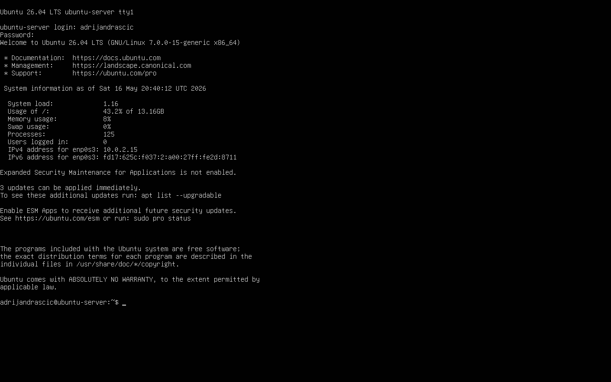


## 2. Ažuriranje sustava

Ažurirana je lokalna lista dostupnih paketa i nadograđeni su svi paketi na najnovije verzije.

### Naredba za ažuriranje liste paketa

```
sudo apt update
```

### Screenshot naredbe apt update

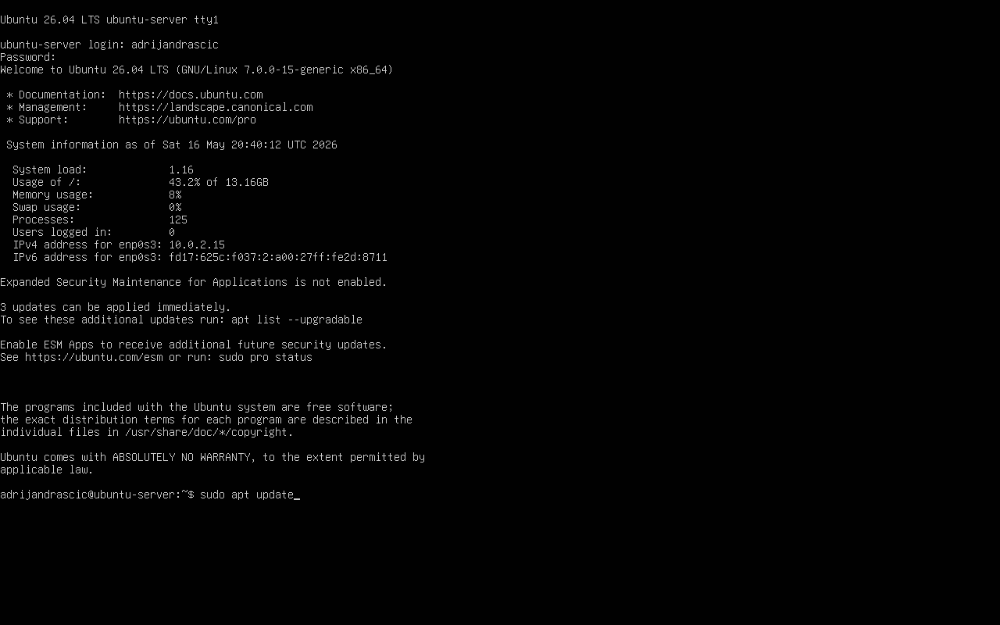
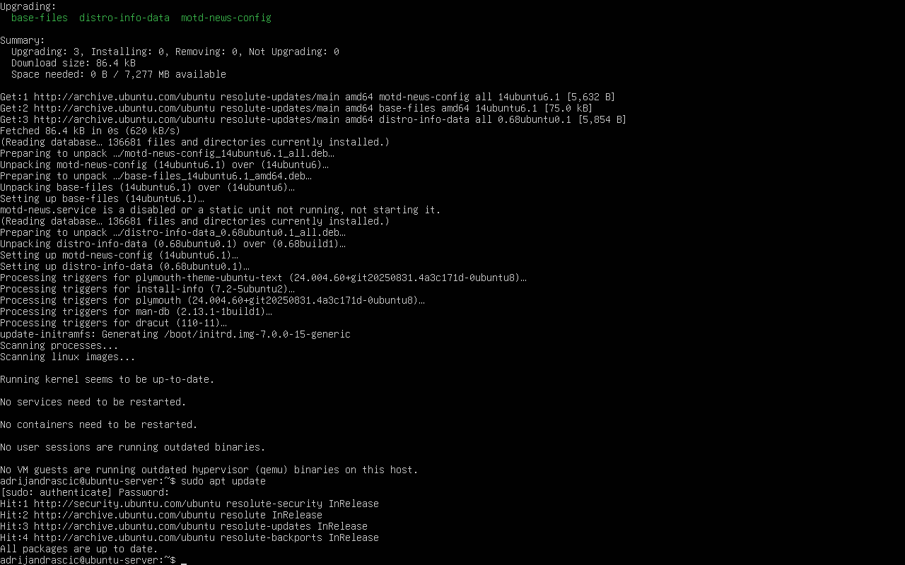

### Nadogradnja paketa

```
sudo apt upgrade -y
```

### Screenshot naredbe apt upgrade

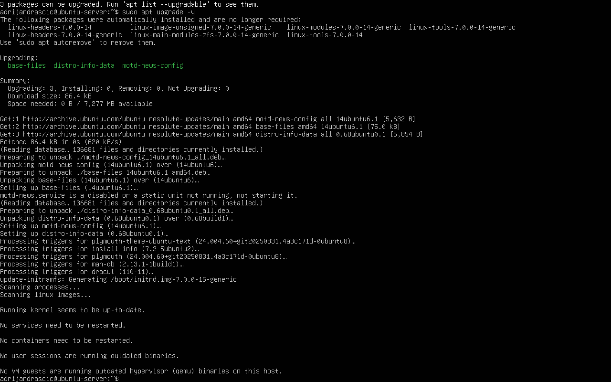

## 3. Instalacija OpenSSH servera

Instalacija OpenSSH server paketa izvršena je naredbom:

```
sudo apt install openssh-server -y
```

### Screenshot instalacije OpenSSH servera

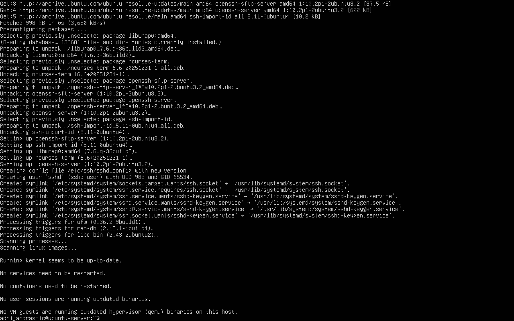

## 4. Pokretanje SSH servisa i provjera statusa

SSH servis pokrenut je naredbom:

```
sudo systemctl start ssh
```

Status SSH servisa provjeren je naredbom:

```
sudo systemctl status ssh
```

Na izlazu je vidljivo da je SSH servis aktivan i pokrenut.

### Screenshot statusa SSH servisa

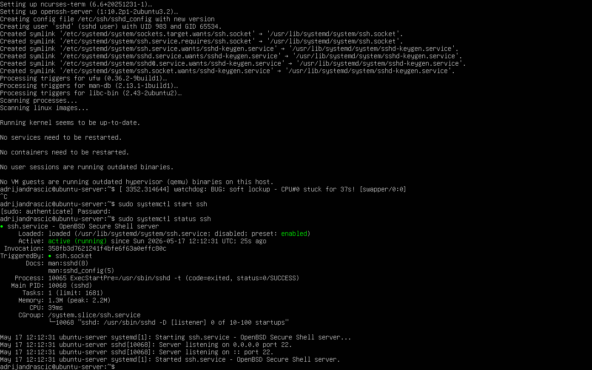

## 5. Pronalaženje IP adrese virtualnog stroja

IP adresa virtualnog stroja pronađena je naredbom:

```
ip a
```

### Screenshot IP adrese

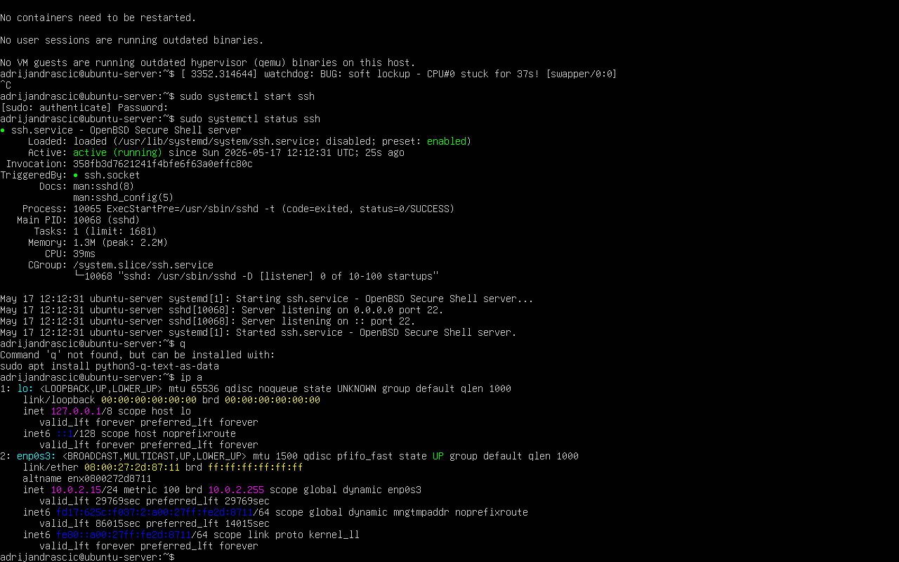

## 6. Provjera otvorenih mrežnih portova

Otvoreni mrežni portovi provjereni su naredbom:

```
sudo ss -tuln
```

Na izlazu je vidljivo da SSH poslužitelj koristi port 22.

### Screenshot otvorenih portova

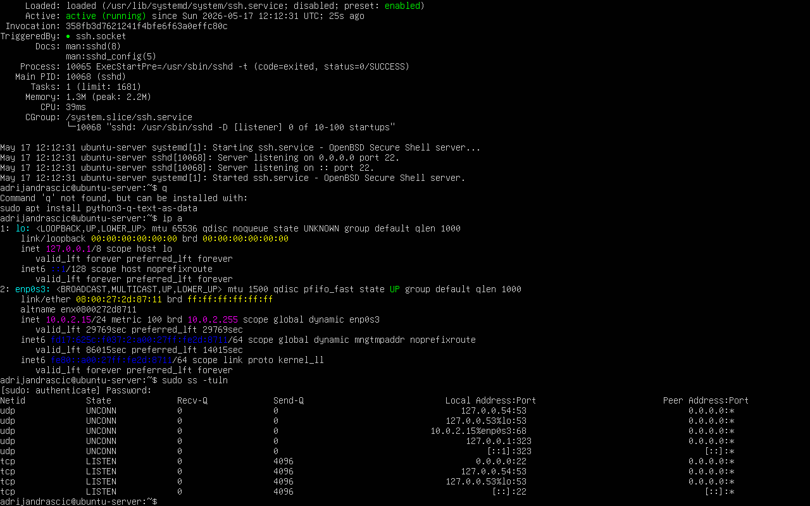

## 7. SSH povezivanje putem NAT moda

U VirtualBoxu je konfiguriran NAT port forwarding:
- Host port: 2222
- Guest port: 22

SSH povezivanje ostvareno je naredbom:

```powershell
ssh adrijandrascic@127.0.0.1 -p 2222
```

### Screenshot NAT port forwardinga

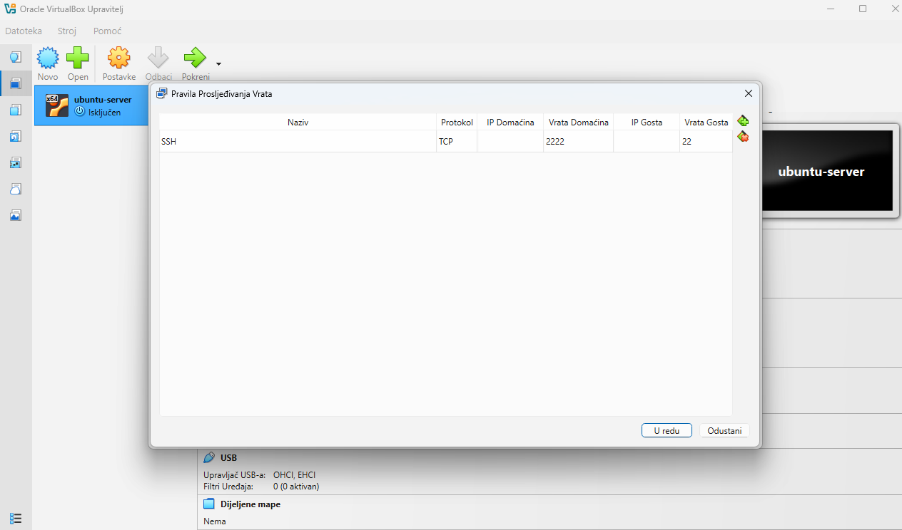

### Screenshot SSH povezivanja putem NAT moda

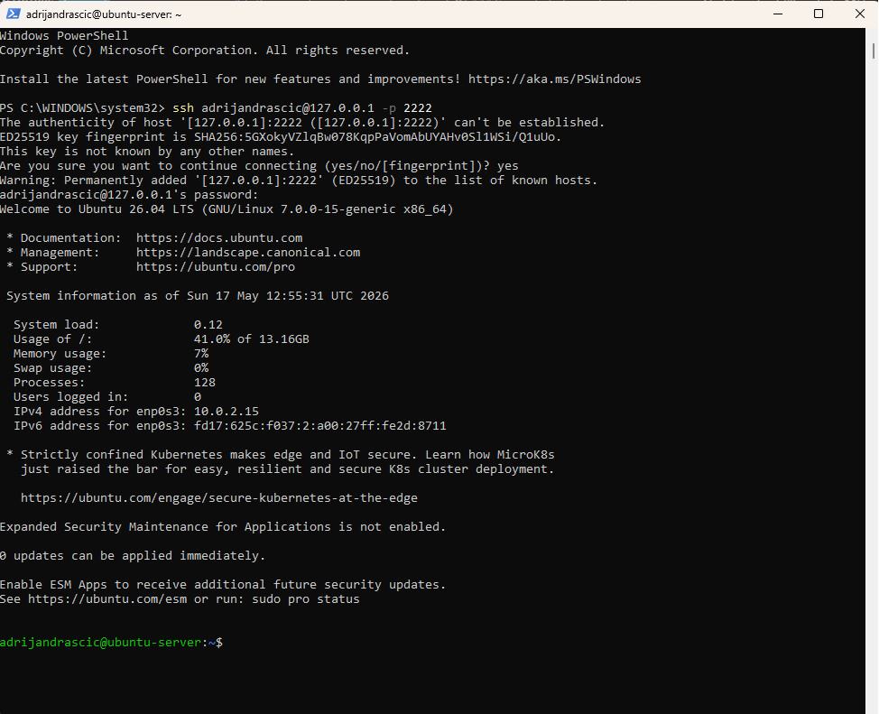

## 8. SSH povezivanje putem Bridged moda

U VirtualBoxu je mrežni adapter promijenjen iz NAT moda u Bridged mode.

Virtualni stroj je nakon toga dobio IP adresu iz lokalne mreže:

```text
192.168.1.25
```

SSH povezivanje ostvareno je iz PowerShell terminala domaćina naredbom:

```powershell
ssh adrijandrascic@192.168.1.25
```

### Screenshot Bridged postavki mrežnog adaptera

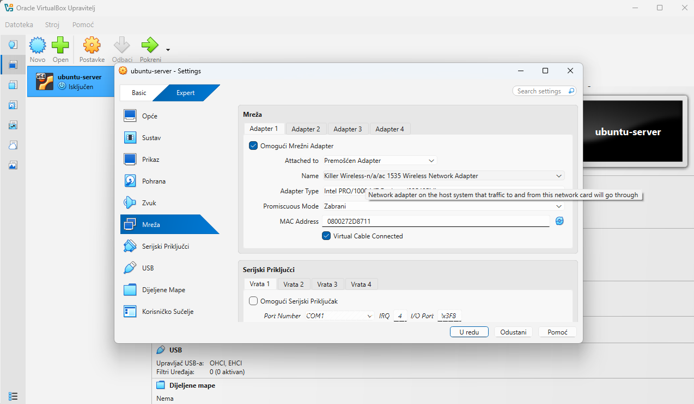

### Screenshot IP adrese u Bridged modu

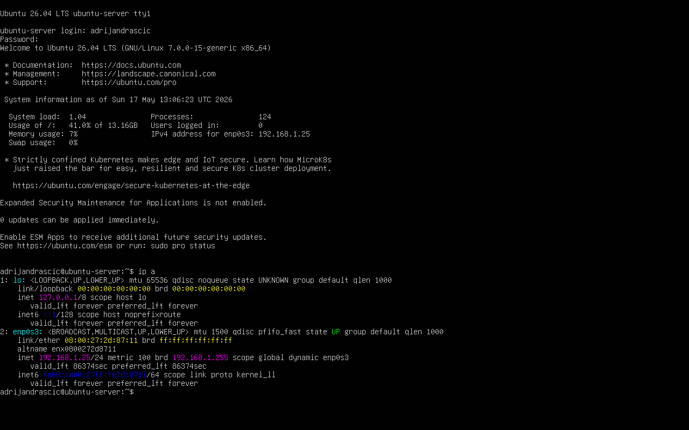

### Screenshot SSH povezivanja putem Bridged moda

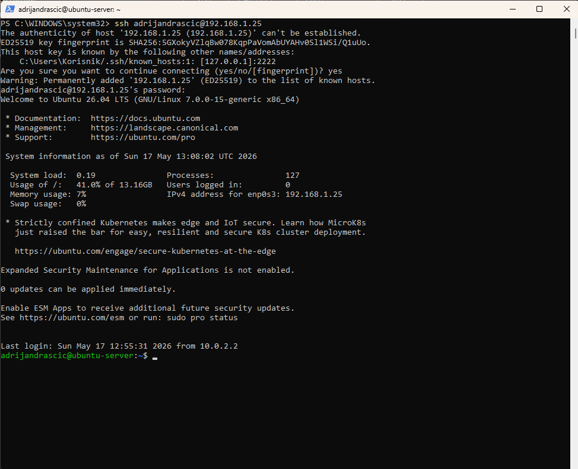

## 9. Bash skripta za ispis root direktorija

Putem SSH veze izrađena je bash skripta unutar direktorija `/home/adrijandrascic/`.

### Kreiranje skripte

```bash
nano /home/adrijandrascic/ispis_root.sh
```

### Sadržaj skripte

```bash
#!/bin/bash

ls -la /
```

### Dodjela execute prava

```bash
chmod +x /home/adrijandrascic/ispis_root.sh
```

### Pokretanje skripte

```bash
bash /home/adrijandrascic/ispis_root.sh
```

Skripta ispisuje detaljan prikaz svih datoteka i direktorija iz korijenskog direktorija `/`, uključujući skrivene datoteke.

### Screenshot uređivanja skripte

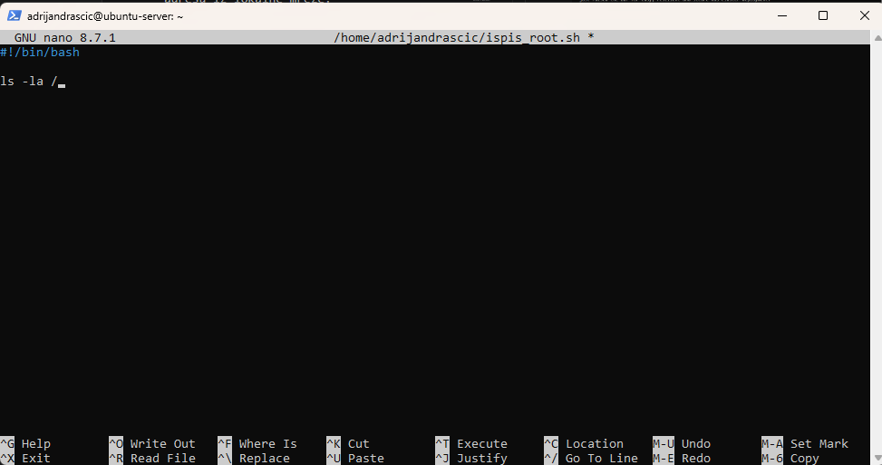

### Screenshot izvršavanja skripte putem SSH terminala

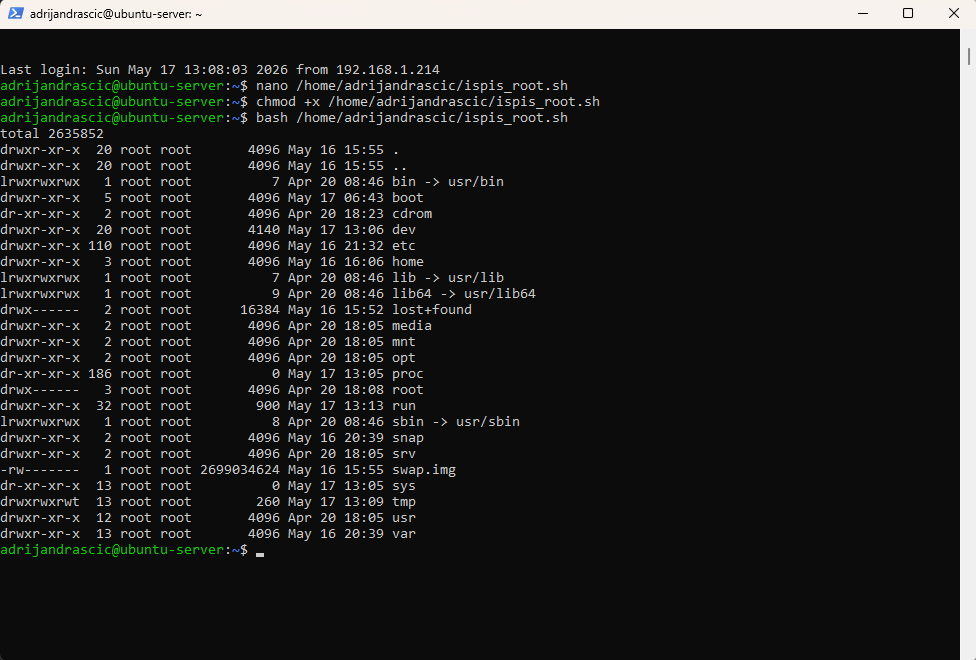

### Screenshot izvršavanja skripte na virtualnom stroju

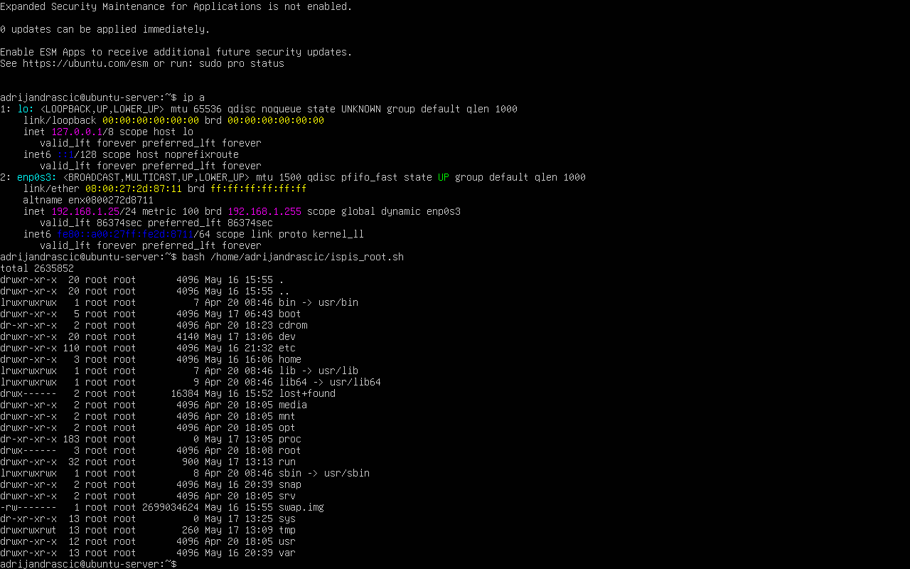