# Vježba 4 - Dodatni bod

## Zadatak 2: Git - the information manager from hell 🔥

Ovaj zadatak bavi se korištenjem Git sustava za upravljanje verzijama te upoznavanjem s poviješću razvoja Git projekta. Također je cilj povezati Bash skripte, Node.js i SSH prijavu u jedinstvenu cjelinu.

## 1. Provjera instalacije Git paketa

Za rad s Git repozitorijima potrebno je imati instaliran Git alat.

Pokrenuo sam naredbu:

```bash
sudo apt install git -y
```

Sustav je potvrdio da je Git već instaliran te da se koristi najnovija dostupna verzija paketa.

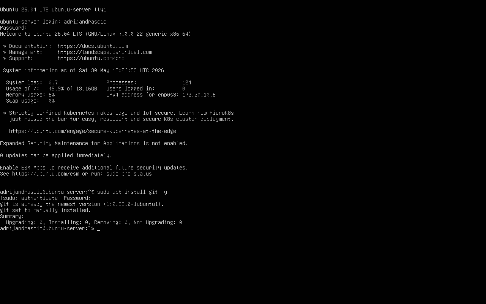

## 2. Provjera verzije Git alata

Uspješnost instalacije provjerio sam ispisom instalirane verzije Git alata.

Pokrenuo sam naredbu:

```bash
git --version
```

Prikazana verzija potvrđuje da je Git uspješno instaliran i dostupan za korištenje iz terminala.

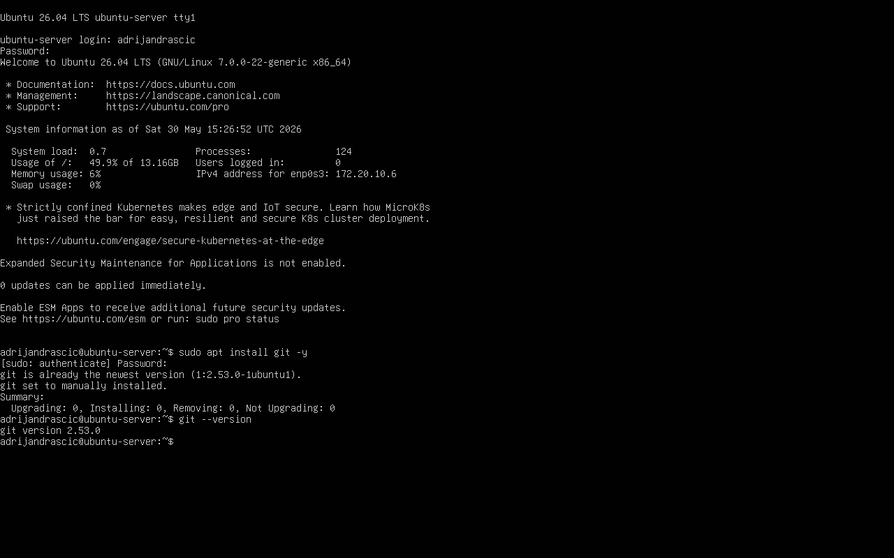

## 3. Kloniranje Git repozitorija

Kako bih mogao istražiti povijest razvoja Git projekta, klonirao sam službeni Git repozitorij s GitHuba.

Pokrenuo sam naredbe:

```bash
cd ~
git clone https://github.com/git/git.git
```

Naredba `git clone` preuzima cijeli repozitorij zajedno sa svim commitovima, granama i poviješću razvoja projekta.

Nakon završetka postupka u korisničkom home direktoriju kreiran je direktorij `git` koji sadrži lokalnu kopiju izvornog Git projekta.

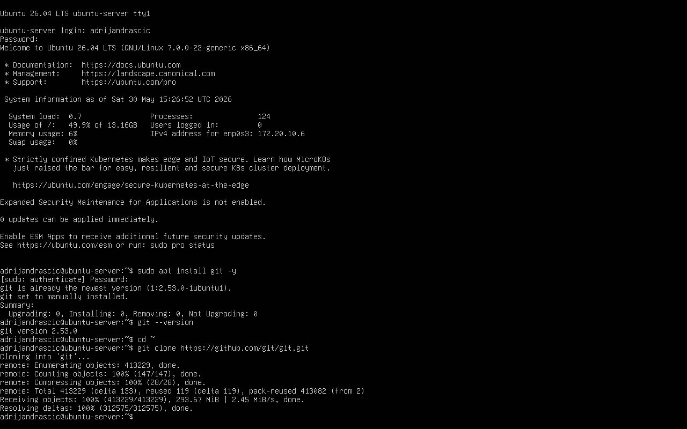

## 4. Pregled povijesti Git projekta

Za pregled povijesti razvoja Git projekta korištena je naredba `git log`.

Kako bih pronašao prvi commit u povijesti projekta, koristio sam naredbu:

```bash
cd ~/git
git log --reverse
```

Opcija `--reverse` prikazuje commitove obrnutim redoslijedom, počevši od najstarijeg prema najnovijem.

Na taj način pronađen je prvi commit Git projekta kojeg je napravio Linus Torvalds 7. travnja 2005. godine.

Poruka prvog commita glasi:

```text
Initial revision of "git", the information manager from hell
```

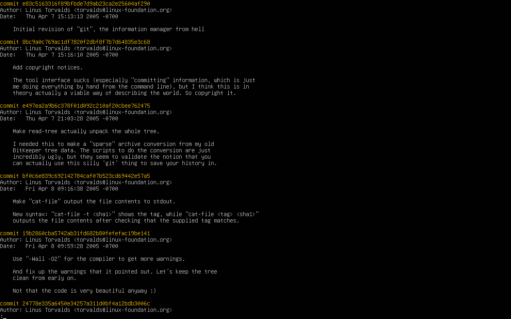

## 5. Pregled Git manuala

Za upoznavanje s dostupnim Git naredbama otvorio sam ugrađenu dokumentaciju Git alata.

Pokrenuo sam naredbu:

```bash
man git
```

Unutar odjeljka **HIGH-LEVEL COMMANDS** pronađena je naredba `git log` koja služi za prikaz povijesti commitova unutar Git repozitorija.

Naredba `git log` omogućuje pregled svih promjena koje su tijekom vremena napravljene u projektu, zajedno s informacijama o autoru, datumu i poruci svakog commita.

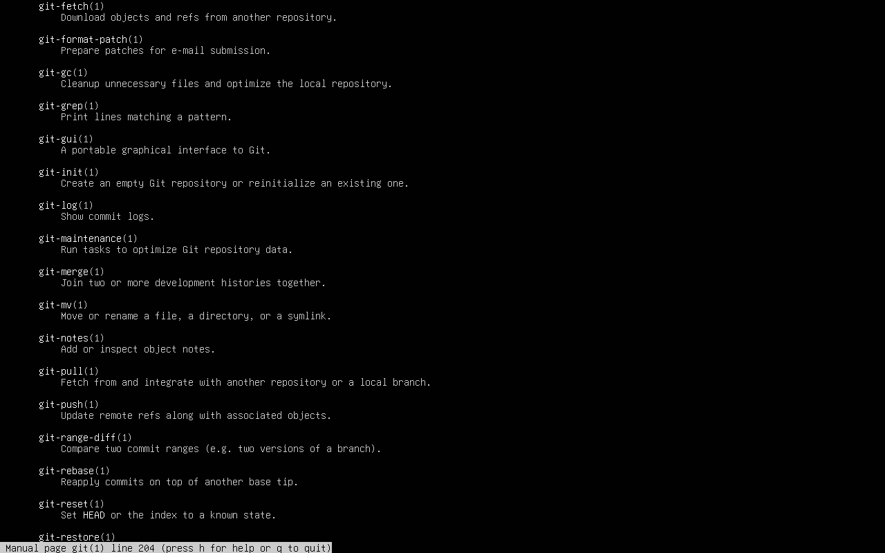

## 6. Provjera preuzetog repozitorija

Nakon kloniranja repozitorija provjerio sam da se nalazim unutar preuzetog Git direktorija.

Pokrenuo sam naredbu:

```bash
pwd
```

Naredba `pwd` ispisuje trenutnu lokaciju u datotečnom sustavu te potvrđuje da se nalazim unutar lokalne kopije Git repozitorija.

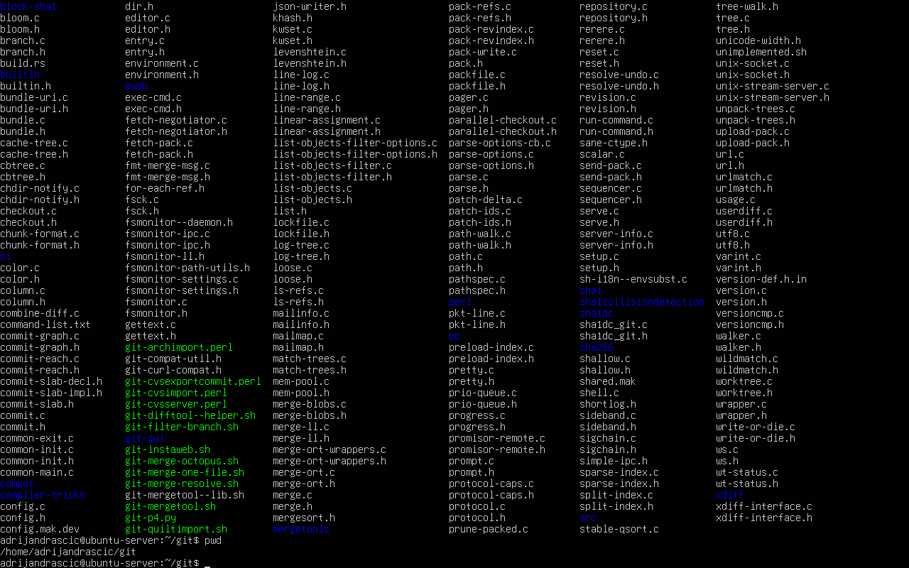

## 7. Izrada Node.js projekta

Za izradu jednostavne aplikacije dobrodošlice kreirao sam novi Node.js projekt.

Pokrenuo sam naredbe:

```bash
cd ~
mkdir welcome_project
cd welcome_project
npm init -y
```

Naredba `npm init -y` automatski kreira datoteku `package.json` sa zadanim postavkama projekta.

Datoteka `package.json` sadrži osnovne informacije o projektu i koristi se za upravljanje ovisnostima unutar Node.js okruženja.

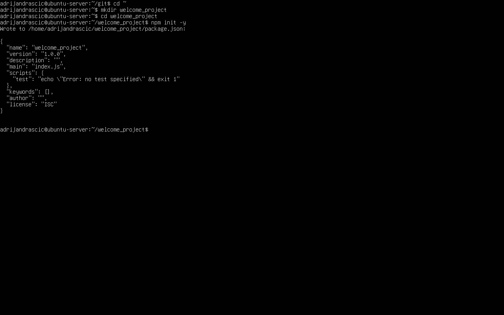

## 8. Uređivanje package.json datoteke

Nakon kreiranja projekta uredio sam datoteku `package.json` te upisao svoje ime i prezime u polje `author`.

Pokrenuo sam naredbu:

```bash
nano package.json
```

Nakon uređivanja sadržaj datoteke provjeren je naredbom:

```bash
cat package.json
```

Polje `author` koristi se za identifikaciju autora projekta.

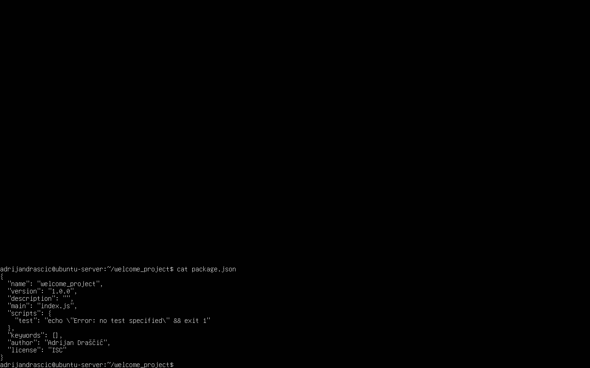

## 9. Instalacija npm paketa greetings

Za generiranje nasumičnih pozdrava na različitim jezicima instalirao sam npm paket `greetings`.

Pokrenuo sam naredbu:

```bash
npm install greetings
```

Naredba `npm install` preuzima paket iz npm repozitorija te ga dodaje u projekt zajedno sa svim potrebnim ovisnostima.

Nakon uspješne instalacije paket je dostupan za korištenje unutar JavaScript programa.

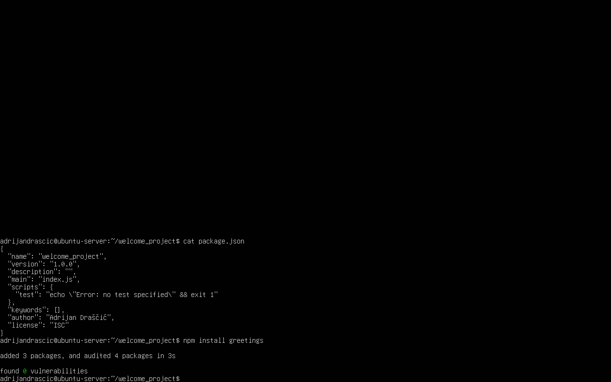

## 10. Izrada JavaScript datoteke

Nakon instalacije paketa `greetings` izradio sam JavaScript datoteku `welcome.js`.

Pokrenuo sam naredbu:

```bash
nano welcome.js
```

Sadržaj datoteke:

```javascript
const greet = require("greetings");
console.log(greet());
```

Za provjeru sadržaja korištena je naredba:

```bash
cat welcome.js
```

Program koristi npm paket `greetings` koji pri svakom pokretanju ispisuje pozdrav na nasumičnom jeziku.

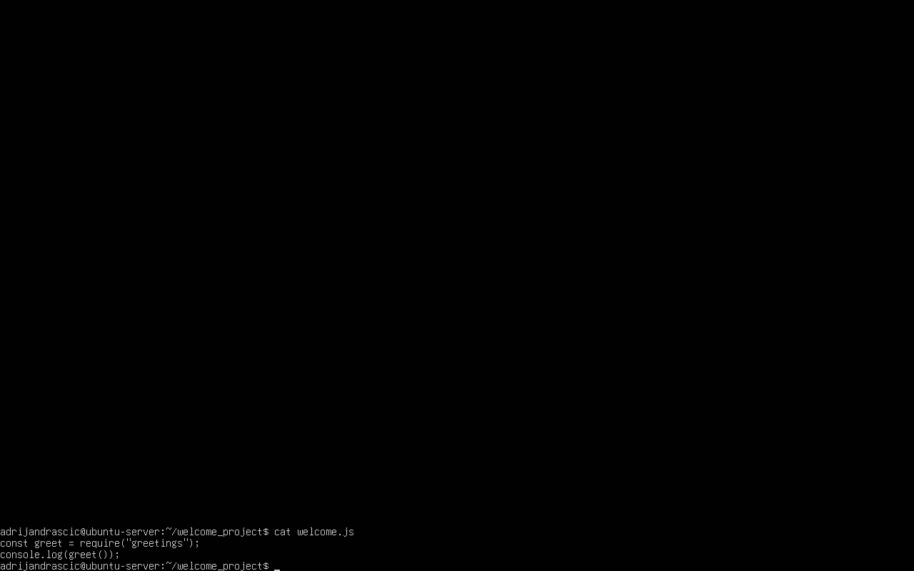

## 11. Pokretanje JavaScript programa

Nakon izrade datoteke pokrenuo sam JavaScript program pomoću Node.js okruženja.

Pokrenuo sam naredbu:

```bash
node welcome.js
```

Program je uspješno učitao paket `greetings` te ispisao poruku dobrodošlice na jednom od podržanih jezika.

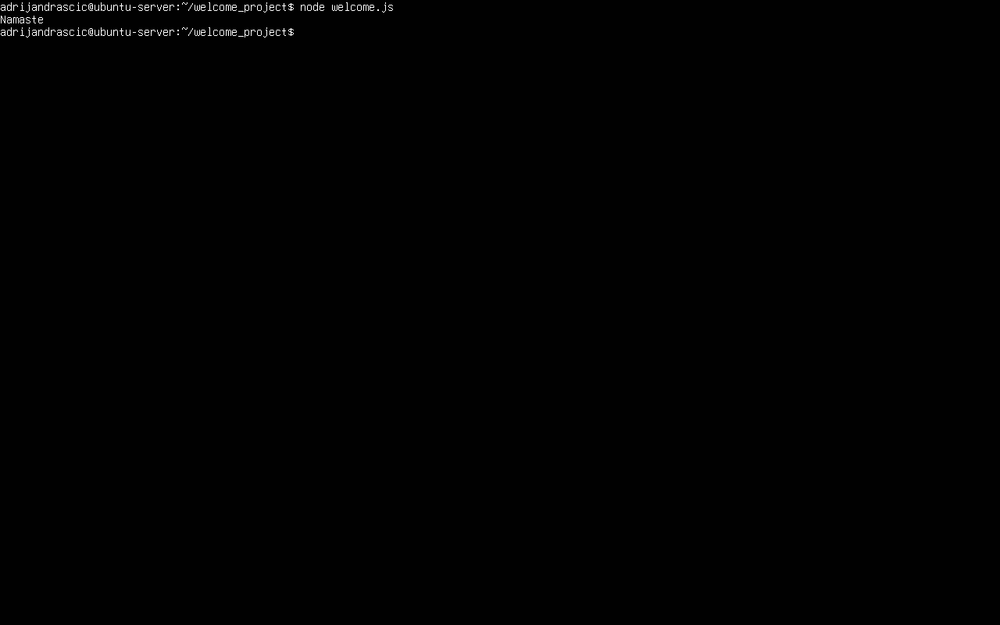

## 12. Izrada i pokretanje Bash skripte

Kako bih kombinirao izlaz JavaScript programa i korisničko ime prijavljenog korisnika, izradio sam Bash skriptu `welcome.sh`.

Za provjeru sadržaja korištena je naredba:

```bash
cat welcome.sh
```

Sadržaj skripte:

```bash
#!/bin/bash

pozdrav=$(node ~/welcome_project/welcome.js)

echo "$pozdrav $USER"
```

Varijabla `pozdrav` pohranjuje izlaz JavaScript programa `welcome.js`, dok Unix varijabla `$USER` sadrži ime trenutno prijavljenog korisnika.

Skripti sam dodijelio dozvolu za izvršavanje te je pokrenuo naredbama:

```bash
chmod +x welcome.sh
./welcome.sh
```

Prilikom izvođenja skripta uspješno kombinira pozdrav generiran Node.js programom i korisničko ime prijavljenog korisnika.

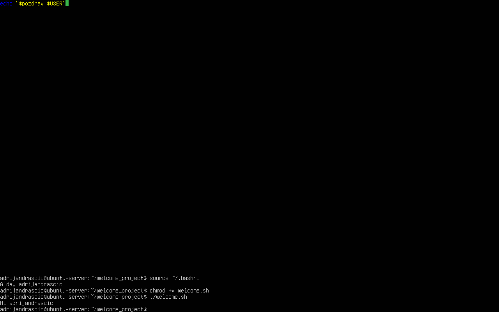

## 13. Dodavanje skripte u .bashrc

Kako bi se poruka dobrodošlice automatski prikazivala prilikom prijave korisnika i pokretanja nove shell sesije, u datoteku `.bashrc` dodan je poziv Bash skripte `welcome.sh`.

Otvorio sam datoteku naredbom:

```bash
nano ~/.bashrc
```

Na kraj datoteke dodan je redak:

```bash
~/welcome_project/welcome.sh
```

Na taj način Bash automatski pokreće skriptu prilikom učitavanja korisničkog okruženja.

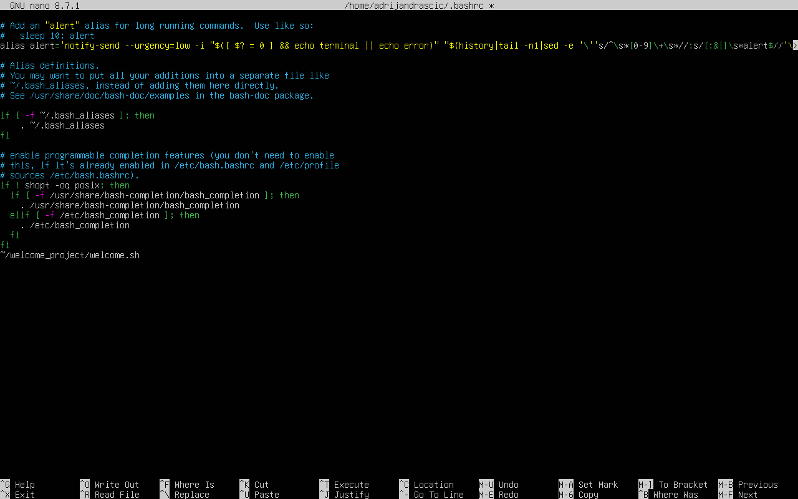

## 14. Ponovno učitavanje .bashrc konfiguracije

Nakon izmjene datoteke `.bashrc` ponovno sam učitao konfiguraciju bez potrebe za odjavom korisnika.

Pokrenuo sam naredbu:

```bash
source ~/.bashrc
```

Naredba `source` izvršava sadržaj datoteke `.bashrc` unutar trenutne shell sesije. Time je odmah aktivirana nova konfiguracija te je prikazana poruka dobrodošlice generirana pomoću Bash skripte i JavaScript programa.

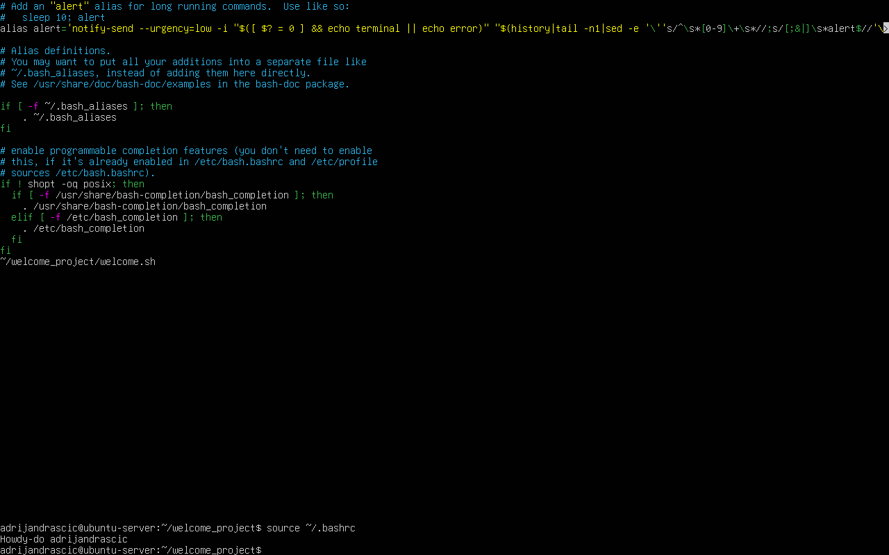

## 15. Provjera automatske poruke dobrodošlice putem SSH-a

Za završnu provjeru povezao sam se na Ubuntu Server putem SSH-a iz novog terminala na Windows računalu.

Pokrenuo sam naredbu:

```powershell
ssh adrijandrascic@172.20.10.6
```

Prilikom uspješne prijave automatski je pokrenuta skripta `welcome.sh`, koja je ispisala personaliziranu poruku dobrodošlice koristeći trenutno prijavljenog korisnika i JavaScript program `welcome.js`.

Time je potvrđeno da se poruka dobrodošlice automatski prikazuje pri svakom SSH povezivanju na poslužitelj.

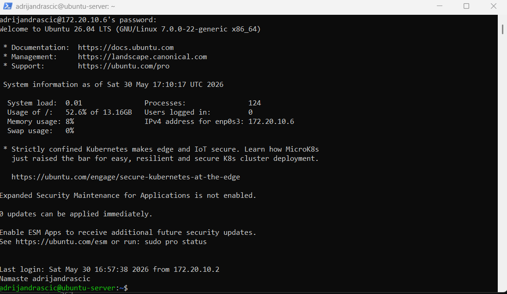
