# Vježba 4 - Dodatni bod

## Zadatak 1: Ubuntu Server, JavaScript, Node.js i krave 🐮

Ovaj zadatak predstavlja nadogradnju prethodne vježbe rada na virtualnom stroju. Cilj zadatka bio je instalirati Node.js okruženje na Ubuntu Server, izraditi jednostavnu JavaScript skriptu te povezati njezino izvođenje s Bash skriptom i paketom cowsay.

## 1. Ažuriranje liste paketa

Prije instalacije novih paketa potrebno je osvježiti lokalnu listu dostupnih paketa i njihovih verzija.

Pokrenuo sam naredbu:

```bash
sudo apt update
```

Nakon izvršavanja naredbe sustav je preuzeo najnovije informacije o dostupnim paketima iz Ubuntu repozitorija.

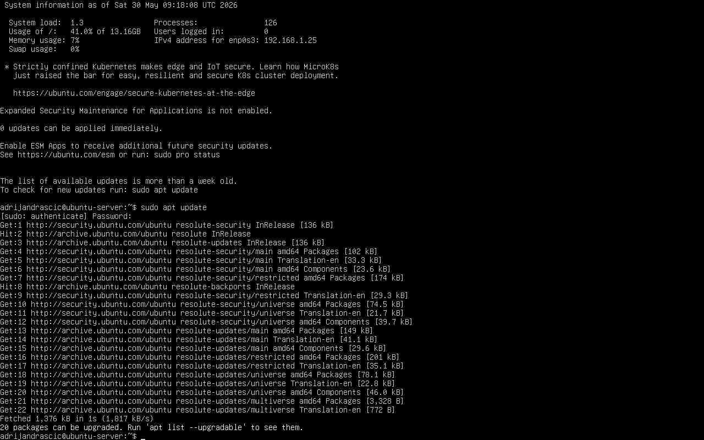

## 2. Nadogradnja instaliranih paketa

Nakon ažuriranja liste paketa nadogradio sam instalirane pakete na najnovije dostupne verzije.

Pokrenuo sam naredbu:

```bash
sudo apt upgrade -y
```

Nadogradnjom sustava osigurano je korištenje najnovijih dostupnih verzija paketa prije instalacije Node.js okruženja.

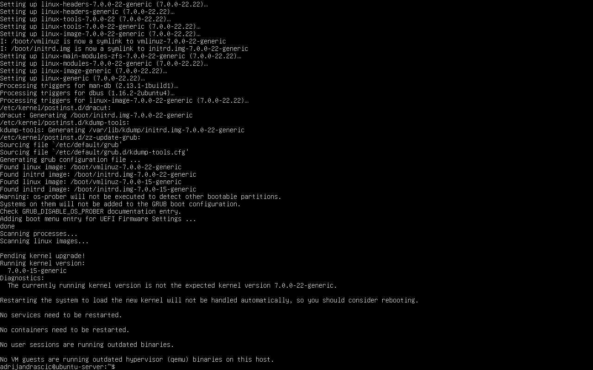

## 3. Instalacija Node.js i npm paketa

Nakon pripreme sustava instalirao sam Node.js i npm (Node Package Manager).

Pokrenuo sam naredbu:

```bash
sudo apt install nodejs npm -y
```

Node.js omogućuje izvođenje JavaScript koda izvan web preglednika, dok npm služi za instalaciju i upravljanje paketima unutar Node.js okruženja.

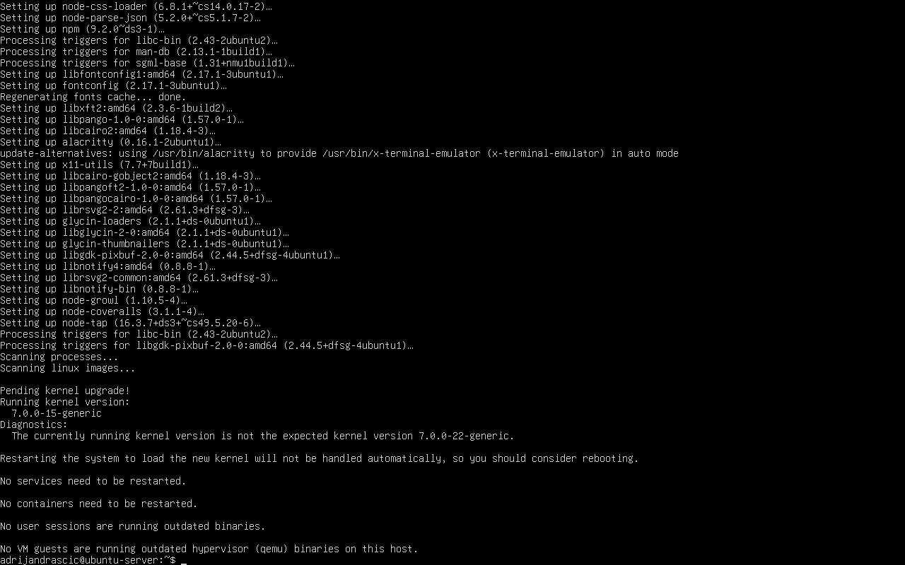

## 4. Provjera uspješne instalacije

Uspješnost instalacije provjerio sam na dva različita načina.

### 4.1 Provjera verzija

Prvi način provjere bio je ispis verzija instaliranih programa Node.js i npm.

Pokrenuo sam naredbe:

```bash
node -v
npm -v
```

Prikazane verzije potvrđuju da su Node.js i npm uspješno instalirani i dostupni za korištenje.

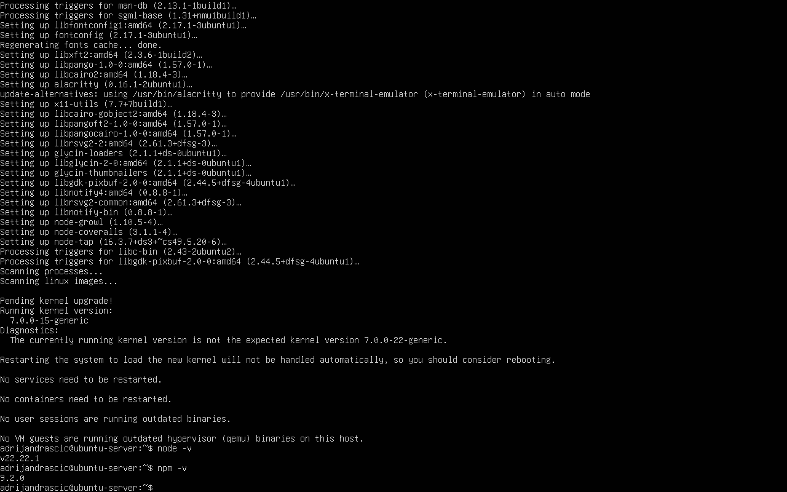

### 4.2 Provjera lokacije izvršnih datoteka

Drugi način provjere bio je pronalazak lokacije izvršnih datoteka Node.js i npm programa u sustavu.

Pokrenuo sam naredbe:

```bash
which node
which npm
```

Naredba `which` prikazuje putanju do izvršne datoteke programa koja se nalazi u korisnikovoj varijabli okruženja PATH. Prikazane putanje potvrđuju da su Node.js i npm ispravno instalirani te dostupni za korištenje iz terminala.


## 5. Izrada direktorija projekta

Za pohranu datoteka korištenih u zadatku izradio sam novi direktorij pod nazivom `node_project` unutar korisničkog home direktorija.

Pokrenuo sam naredbe:

```bash
cd ~
mkdir node_project
ls
```

Naredbom `mkdir` kreiran je novi direktorij `node_project` unutar korisničkog home direktorija. Naredba `ls` korištena je za provjeru uspješno izrađenog direktorija.

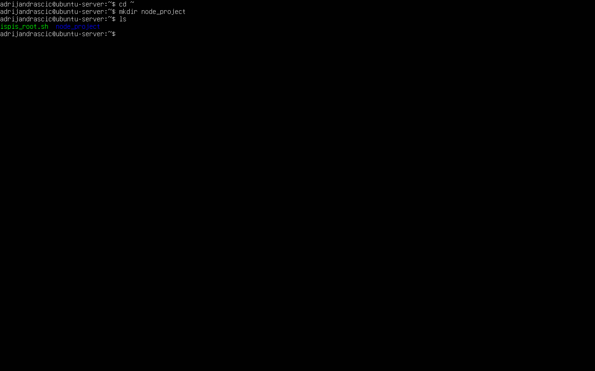

## 6. Pokretanje Node.js REPL okruženja

Kako bih isprobao Node.js okruženje, pokrenuo sam interaktivni REPL (Read-Eval-Print Loop) način rada.

Pokrenuo sam naredbu:

```bash
node
```

Nakon pokretanja REPL okruženja moguće je izravno izvršavati JavaScript naredbe bez izrade datoteke.

Za izlazak iz REPL okruženja koristi se naredba:

```javascript
.exit
```

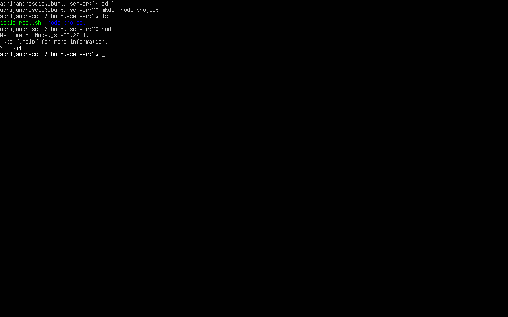

## 7. Izrada JavaScript datoteke

Nakon upoznavanja s Node.js REPL okruženjem izradio sam datoteku `hello.js` unutar direktorija `node_project`. Datoteka sadrži jednostavan JavaScript program koji pohranjuje ime i prezime u varijablu te ispisuje poruku koristeći interpolaciju stringova.

Za uređivanje datoteke korišten je uređivač teksta `nano`.

Pokrenuo sam naredbu:

```bash
nano node_project/hello.js
```

U datoteku je upisan sljedeći sadržaj:

```javascript
const imePrezime = "Adrijan Draščić";

console.log(`Pozdrav ja sam ${imePrezime} i uspješno sam pokrenuo JS u Node.js okruženju!`);
```

Za provjeru sadržaja datoteke korištena je naredba:

```bash
cat node_project/hello.js
```

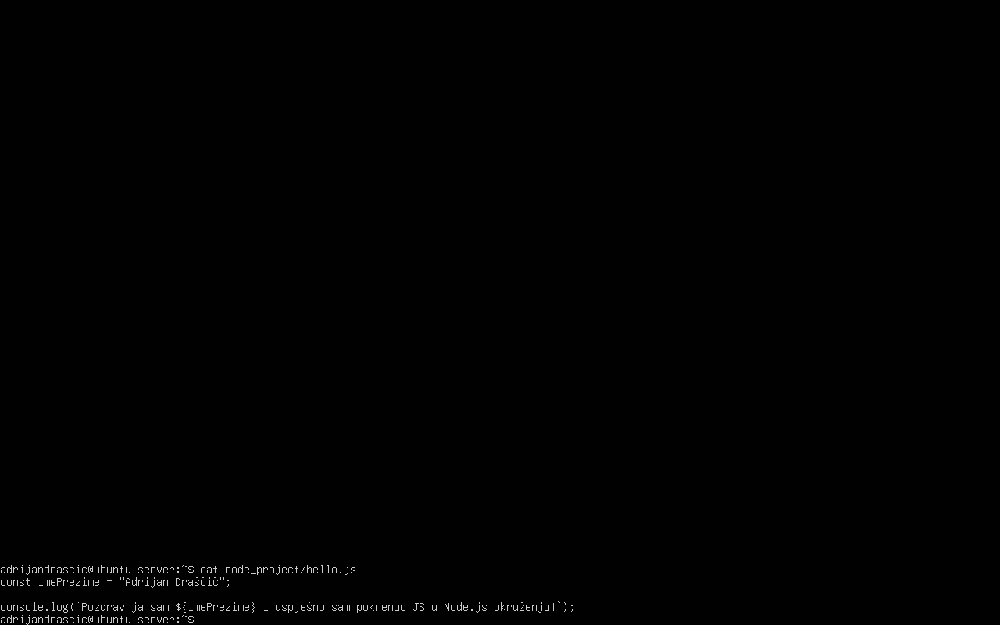

## 8. Pokretanje JavaScript skripte

Nakon izrade datoteke `hello.js` pokrenuo sam njezino izvršavanje pomoću Node.js okruženja.

Pokrenuo sam naredbu:

```bash
node node_project/hello.js
```

Node.js je uspješno izvršio JavaScript kod iz datoteke te ispisao poruku definiranu u programu.

Na taj način potvrđeno je da Node.js može izvršavati JavaScript kod pohranjen u vanjskoj datoteci.

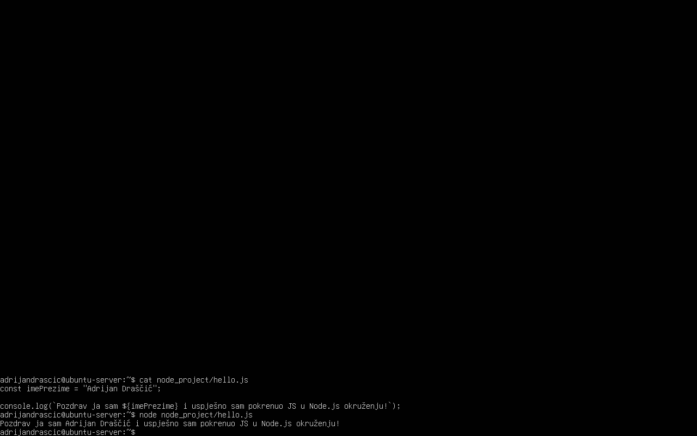

## 9. Instalacija paketa cowsay

Kako bih mogao ispisivati poruke u obliku ASCII krave, instalirao sam paket `cowsay`.

Pokrenuo sam naredbu:

```bash
sudo apt install cowsay -y
```

Paket `cowsay` omogućuje prikaz tekstualnih poruka unutar govornog oblačića iznad ASCII prikaza krave ili drugih dostupnih likova.

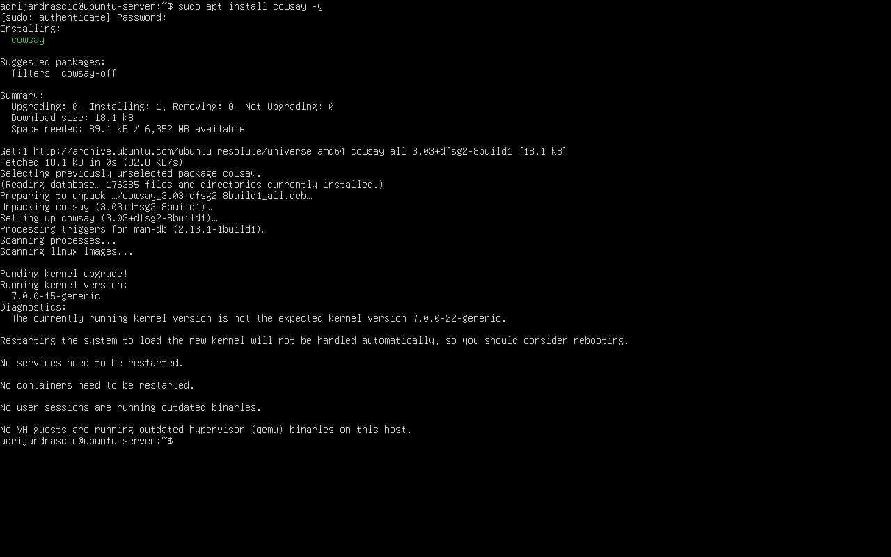

## 10. Pregled dokumentacije naredbe cowsay

Za upoznavanje s mogućnostima naredbe `cowsay` proučio sam njezinu ugrađenu dokumentaciju pomoću naredbe `man`.

Pokrenuo sam naredbu:

```bash
man cowsay
```

Iz dokumentacije je vidljivo da naredba podržava različite zastavice kojima se može mijenjati izgled i raspoloženje krave te dodatne opcije za prilagodbu izgleda poruke.

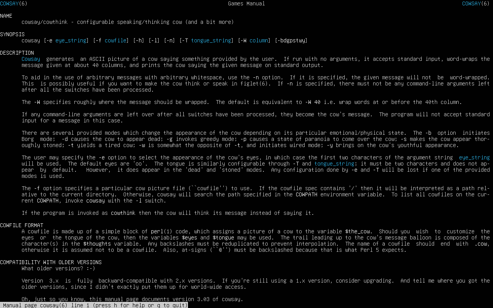

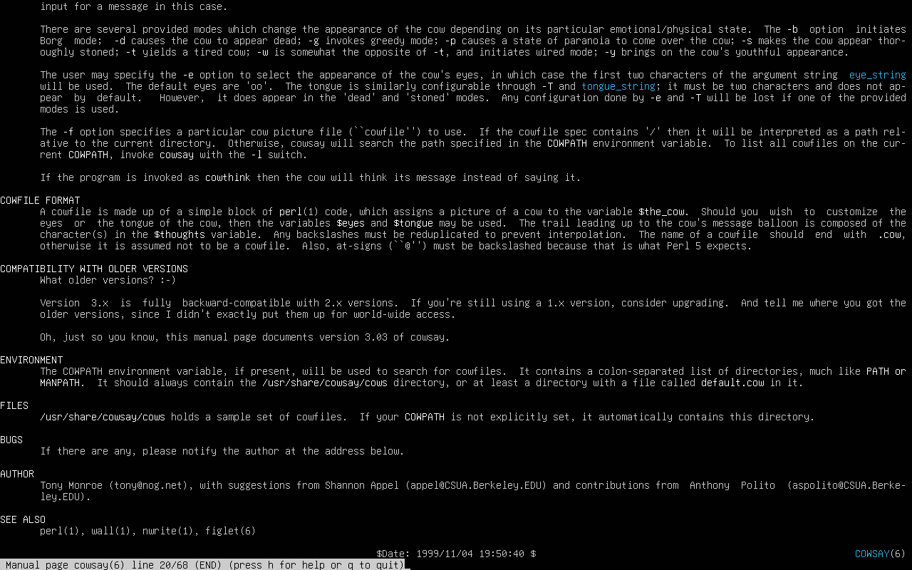

### Pronađene zastavice

Iz dokumentacije su pronađene sljedeće zastavice koje mijenjaju izgled krave:

| Zastavica | Opis                     |
| --------- | ------------------------ |
| `-b`      | Borg krava               |
| `-d`      | Mrtva krava              |
| `-g`      | Pohlepna krava           |
| `-p`      | Paranoična krava         |
| `-s`      | Ošamućena (stoned) krava |
| `-t`      | Umorna krava             |
| `-w`      | Uzbunjena (wired) krava  |
| `-y`      | Mlada krava              |

Osim navedenih zastavica dostupne su i dodatne opcije:

| Zastavica | Opis                         |
| --------- | ---------------------------- |
| `-e`      | Prilagodba očiju             |
| `-T`      | Prilagodba jezika            |
| `-f`      | Odabir drugog lika (cowfile) |
| `-l`      | Popis dostupnih likova       |
| `-n`      | Bez prelamanja teksta        |
| `-W`      | Širina poruke                |
| `-h`      | Pomoć                        |
|           |                              |

## 11. Izrada Bash skripte

Unutar direktorija `node_project` izradio sam Bash skriptu `krava.sh`. Skripta očekuje točno jedan argument koji predstavlja poruku za prikaz pomoću naredbe `cowsay`.

Za uređivanje datoteke korišten je uređivač teksta `nano`.

Pokrenuo sam naredbu:

```bash
nano krava.sh
```

U datoteku je upisan sljedeći sadržaj:

```bash
#!/bin/bash

if [ "$#" -ne 1 ]; then
    echo "Greška: potrebno je proslijediti točno jedan argument."
    exit 1
fi

poruka="$1"

cowsay "$poruka"
```

Za provjeru sadržaja skripte korištena je naredba:

```bash
cat krava.sh
```

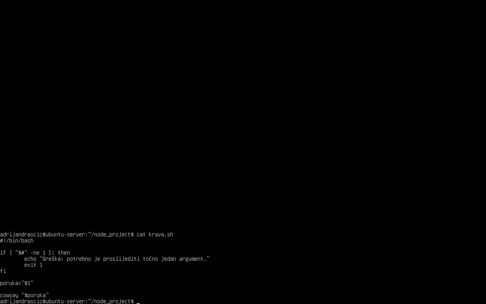

Nakon izrade skripti su dodijeljena prava za izvršavanje:

```bash
chmod +x krava.sh
```
## 12. Pokretanje Bash skripte

Nakon izrade i dodjele prava za izvršavanje testirao sam rad skripte.

Prvo sam pokrenuo skriptu bez proslijeđenog argumenta:

```bash
./krava.sh
```

Skripta je ispravno prepoznala da nije proslijeđen točno jedan argument te je ispisala poruku o grešci i prekinula izvođenje.

Nakon toga pokrenuo sam skriptu s jednim argumentom:

```bash
./krava.sh "Pozdrav iz Bash skripte"
```

Skripta je uspješno prihvatila argument te ga proslijedila naredbi `cowsay`, koja je prikazala poruku unutar govornog oblačića iznad ASCII prikaza krave.

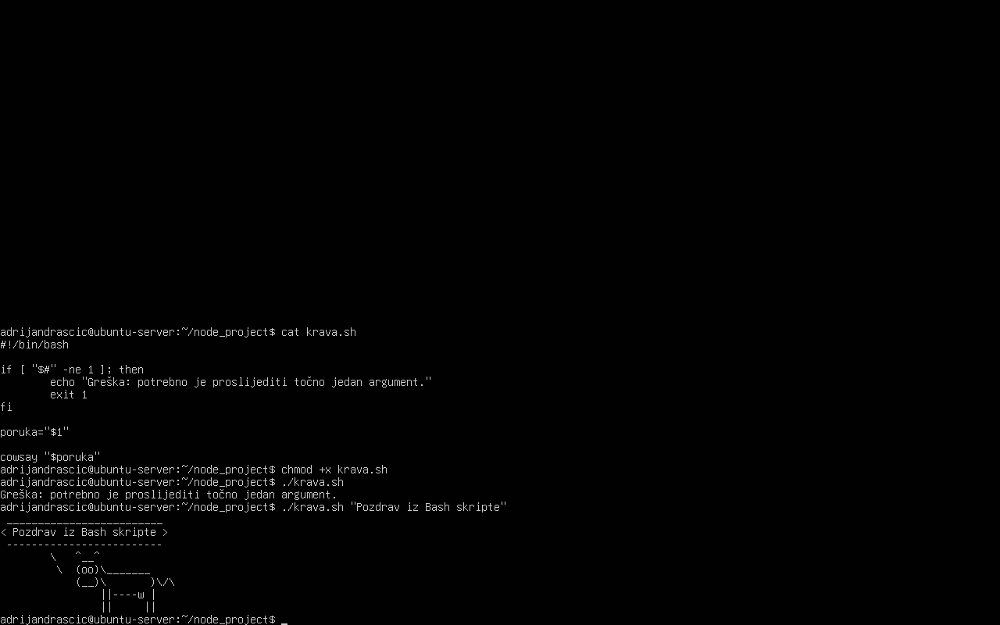

## 13. Pozivanje Bash skripte s izlazom Node.js programa

Jedan od zahtjeva zadatka bio je proslijediti Bash skripti rezultat izvođenja JavaScript programa korištenjem supstitucije naredbi.

Pokrenuo sam naredbu:

```bash
./krava.sh "$(node hello.js)"
```

Naredba `node hello.js` izvršava JavaScript program i vraća njegov izlaz. Korištenjem supstitucije naredbi `$(...)` taj izlaz se prosljeđuje kao argument Bash skripti `krava.sh`.

Skripta je zatim primljeni tekst proslijedila naredbi `cowsay`, koja je prikazala poruku unutar govornog oblačića iznad ASCII prikaza krave.

Na taj način uspješno je ostvarena povezanost između JavaScript programa pokrenutog u Node.js okruženju i Bash skripte.

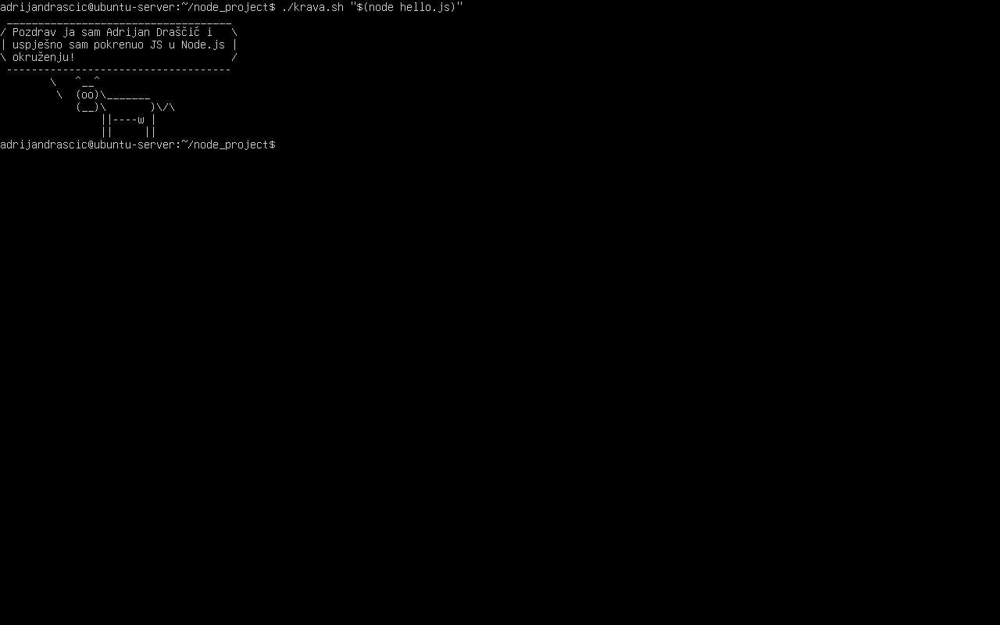

## 14. Nadogradnja Bash skripte za podršku cowsay zastavicama

Prema zahtjevu zadatka nadogradio sam skriptu `krava.sh` tako da osim poruke može prihvatiti i jednu dodatnu zastavicu za naredbu `cowsay`.

Skripta provjerava je li korisnik proslijedio ispravan broj argumenata te je li proslijeđena zastavica među podržanim cowsay zastavicama.

Podržane zastavice su:

```text
-b  -d  -g  -p  -s  -t  -w  -y
```

Ako korisnik proslijedi neispravnu zastavicu, skripta ispisuje poruku o grešci i prekida izvođenje.

Za provjeru konačne verzije skripte korištena je naredba:

```bash
cat krava.sh
```

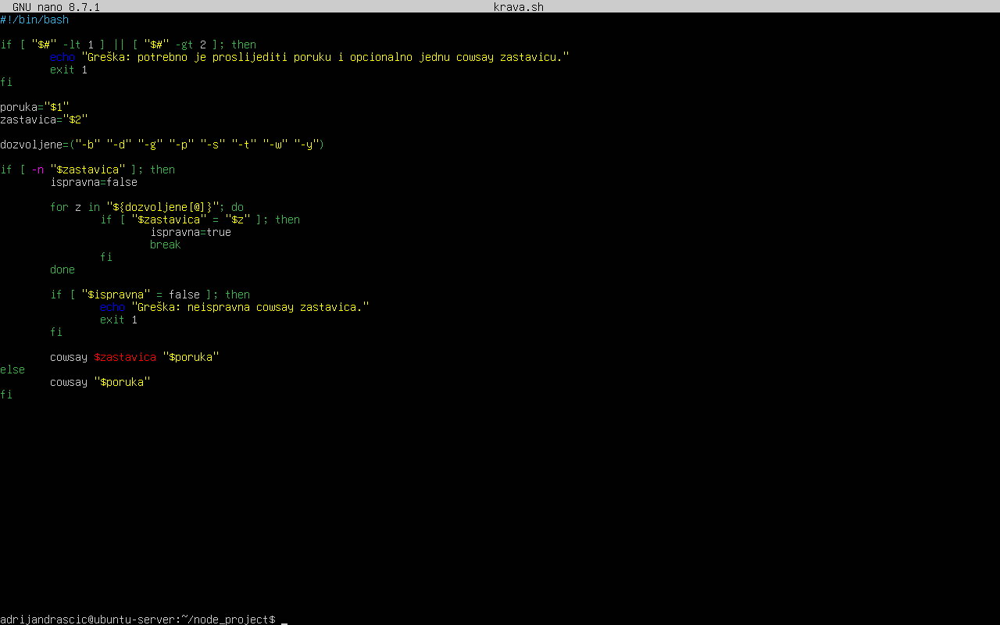

## 15. Testiranje podrške za cowsay zastavice

Nakon nadogradnje skripte testirao sam njezin rad s ispravnom i neispravnom zastavicom.

Pokrenuo sam naredbu:

```bash
./krava.sh "Pozdrav iz Node.js-a" -g
```

Skripta je uspješno prihvatila zastavicu `-g` te prikazala poruku koristeći cowsay način rada "greedy", pri čemu su oči krave prikazane kao `$$`.

Također sam provjerio ponašanje skripte pri unosu neispravne zastavice:

```bash
./krava.sh "Pozdrav iz Node.js-a" -x
```

Skripta je prepoznala neispravnu zastavicu, ispisala poruku o grešci te prekinula izvođenje.

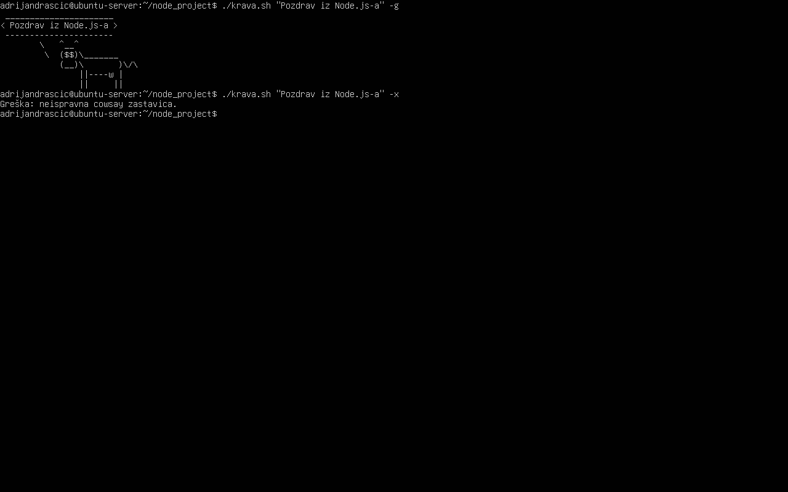

## Zaključak

U ovoj vježbi instalirao sam Node.js i npm na Ubuntu Server, upoznao se s Node.js REPL okruženjem te izradio JavaScript program koji se izvršava iz terminala. Također sam instalirao paket cowsay i izradio Bash skriptu koja koristi izlaz JavaScript programa kao ulazni argument. Na kraju je skripta nadograđena podrškom za cowsay zastavice i provjerom ispravnosti korisničkog unosa.