## Zadatak 1

Najprije sam ažurirao popis paketa te provjerio dostupnost paketa `python3` i `htop`.

```bash
sudo apt update
sudo apt install python3 htop -y
```

Sustav je javio da su oba paketa već instalirana te nije bilo potrebe za dodatnom instalacijom.

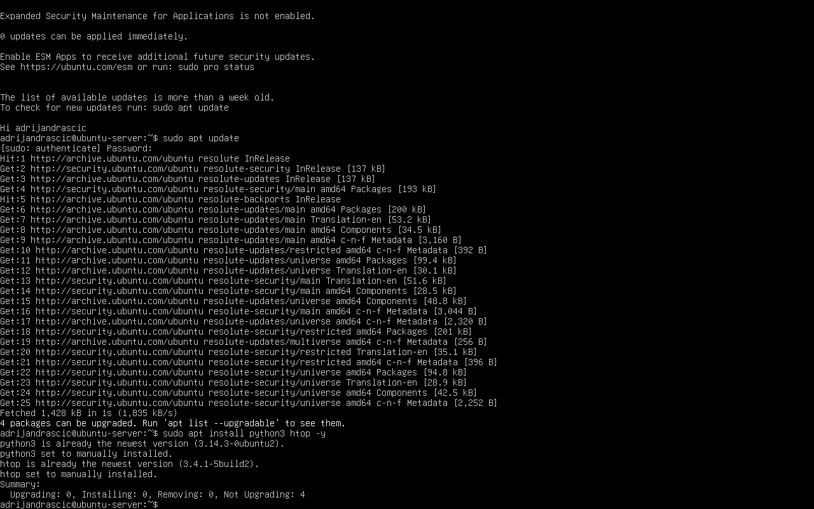

Nakon toga kreirao sam direktorij `python3` unutar svog korisničkog direktorija te se pozicionirao u njega.

```bash
mkdir ~/python3
cd ~/python3
```


Zatim sam kreirao novu Python datoteku `hello.py` koristeći uređivač teksta Nano.

```bash
nano hello.py
```

U datoteku sam upisao sljedeći Python kod:

```python
import time
import os

print("Hello World!")
print("PID:", os.getpid())

time.sleep(100)

print("Goodbye World!")
```

Skripta ispisuje poruku dobrodošlice, prikazuje PID procesa, čeka 100 sekundi te nakon isteka vremena ispisuje završnu poruku.

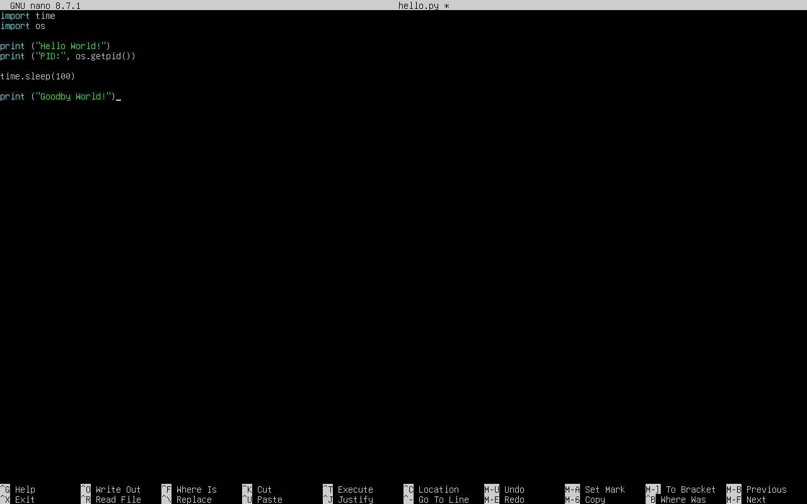

Nakon izrade skripte pokrenuo sam ju pomoću Python interpretera.

```bash
python3 hello.py
```

Prilikom pokretanja skripta je ispisala poruku dobrodošlice te PID trenutno pokrenutog procesa.

```text
Hello World!
PID: 2088
```

PID (Process ID) predstavlja jedinstveni identifikator procesa koji operacijski sustav dodjeljuje svakom pokrenutom procesu.

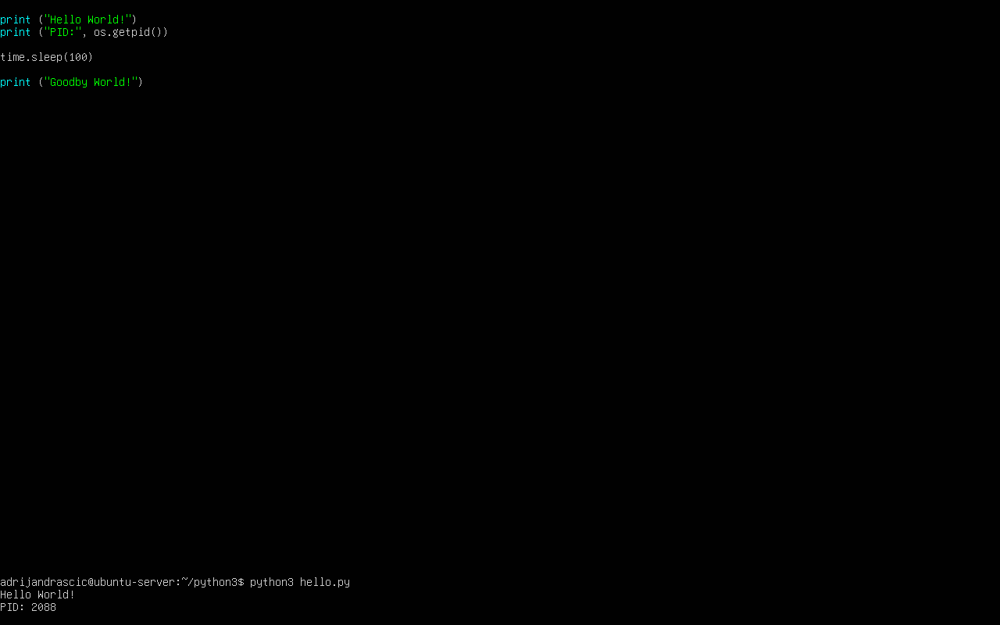

Nakon izrade skripte pokrenuo sam ju kako bih provjerio ispravan rad programa.

```bash
python3 hello.py
```

Prilikom pokretanja skripta je ispisala poruku dobrodošlice te PID trenutno pokrenutog procesa.

```text
Hello World!
PID: 2088
```

PID (Process ID) predstavlja jedinstveni identifikator procesa koji operacijski sustav dodjeljuje svakom pokrenutom procesu.


Nakon provjere rada skripte pokrenuo sam ju u pozadini kako bih mogao analizirati proces tijekom izvršavanja.

```bash
python3 hello.py &
```

Pokretanjem u pozadini sustav je dodijelio PID procesa te je terminal ostao dostupan za daljnji rad.

```text
[1] 2099
```

Zatim sam pomoću alata `htop` pronašao proces `python3 hello.py` te analizirao njegove karakteristike.

```bash
htop
```

Analiza prikazanih podataka:

| Stupac  | Opis                                            |
| ------- | ----------------------------------------------- |
| PID     | Jedinstveni identifikator procesa               |
| USER    | Korisnik koji je pokrenuo proces                |
| PRI     | Prioritet procesa                               |
| NI      | Nice vrijednost procesa                         |
| VIRT    | Ukupna virtualna memorija rezervirana za proces |
| RES     | Stvarna fizička memorija koju proces koristi    |
| SHR     | Dijeljena memorija                              |
| S       | Trenutno stanje procesa                         |
| %CPU    | Postotak korištenja procesora                   |
| %MEM    | Postotak korištenja radne memorije              |
| TIME+   | Ukupno vrijeme korištenja procesora             |
| Command | Naredba kojom je proces pokrenut                |

Kod promatranog procesa vidljivo je da se radi o procesu `python3 hello.py`, koji se nalazi u stanju `S` (sleeping), odnosno čeka završetak funkcije `sleep()` unutar skripte.

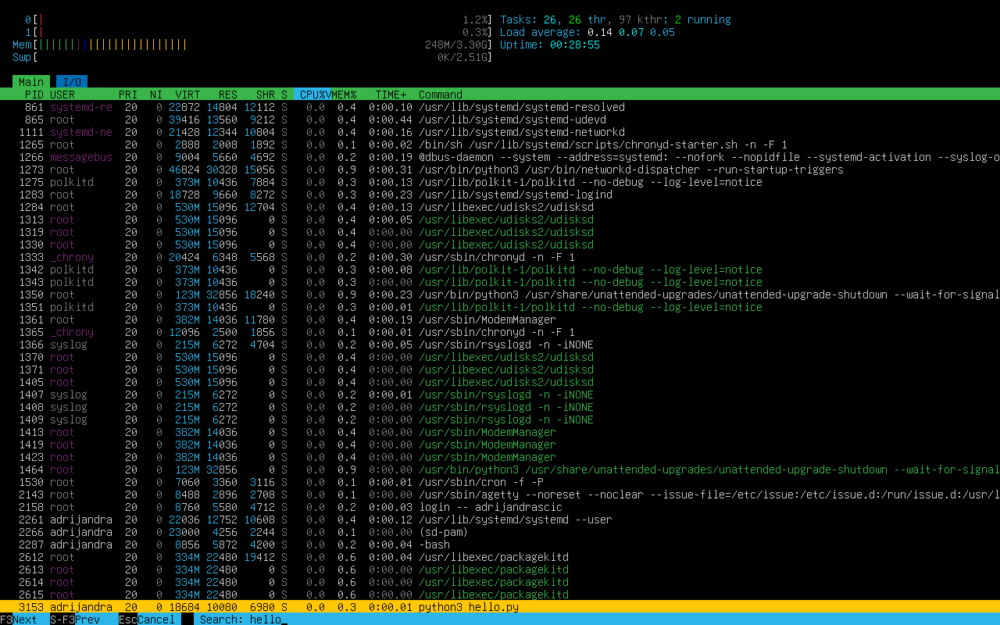

Za prekid procesa koristio sam naredbu `kill` zajedno s PID oznakom procesa.

Najprije sam ponovno pokrenuo skriptu u pozadini te zabilježio PID procesa.

```bash
python3 hello.py &
```

Nakon toga proces sam prekinuo naredbom:

```bash
kill 3189
```

Status procesa provjerio sam naredbom:

```bash
ps -p 3189
```

Budući da se proces više nije prikazivao u popisu procesa, potvrđeno je da je uspješno ugašen.

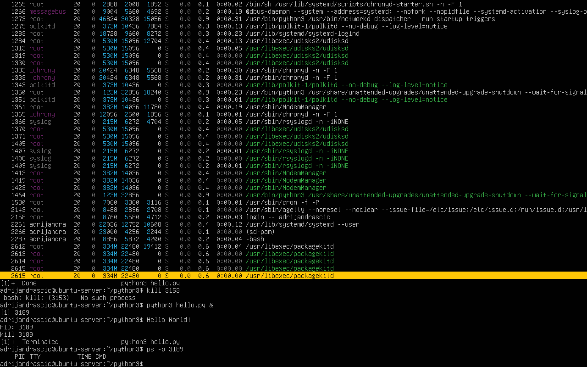

Proces je moguće prekinuti na više načina:

```bash
kill PID
kill -15 PID
kill -9 PID
```

* `kill PID` šalje zadani signal `SIGTERM`.
* `kill -15 PID` eksplicitno šalje signal `SIGTERM`.
* `kill -9 PID` šalje signal `SIGKILL` kojim se proces prisilno prekida.

Time je uspješno izvršen prvi zadatak.

## Zadatak 2

U drugom zadatku potrebno je napisati Bash skriptu koja postupno premješta datoteke iz direktorija `old_dir` u direktorij `new_dir`, uz ispis poruke nakon svakog premještanja te pauzu od jedne sekunde.

Najprije sam se pozicionirao u vlastiti home direktorij.

```bash
cd ~
```

Nakon toga kreirao sam direktorije `old_dir` i `new_dir`.

```bash
mkdir old_dir
mkdir new_dir
```

U direktorij `old_dir` dodao sam nekoliko testnih datoteka koje će služiti za provjeru rada skripte.

```bash
touch old_dir/file1.txt
touch old_dir/file2.txt
touch old_dir/file3.txt
touch old_dir/file4.txt
```

Sadržaj direktorija provjerio sam naredbom:

```bash
ls -l old_dir
```

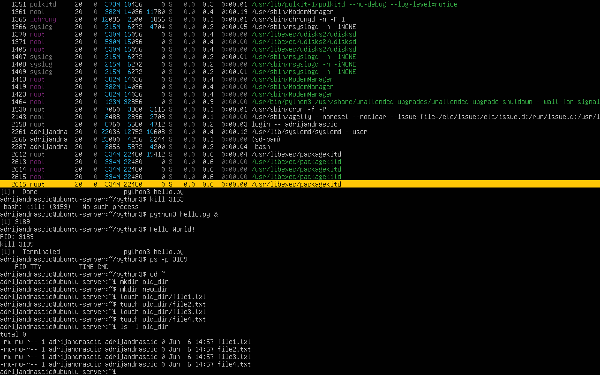

Nakon pripreme direktorija izradio sam Bash skriptu `move_files.sh`.

```bash
#!/bin/bash

for file in old_dir/*
do
    mv "$file" new_dir/
    echo "Datoteka prebačena"
    sleep 1
done
```

Skripta prolazi kroz sve datoteke u direktoriju `old_dir`, premješta ih u direktorij `new_dir`, ispisuje poruku o uspješnom premještanju te nakon svake operacije čeka jednu sekundu.

Za pokretanje skripte dodijelio sam joj dozvolu za izvršavanje.

```bash
chmod +x move_files.sh
```


Nakon dodjeljivanja dozvole za izvršavanje pokrenuo sam skriptu.

```bash
./move_files.sh
```

Tijekom izvođenja skripta je za svaku datoteku ispisala poruku:

```text
Datoteka prebačena
```

te pričekala jednu sekundu prije nastavka rada.

Nakon završetka rada provjerio sam sadržaj direktorija `old_dir` i `new_dir`.

```bash
ls old_dir
ls new_dir
```

Direktorij `old_dir` ostao je prazan, dok su sve datoteke uspješno premještene u direktorij `new_dir`.

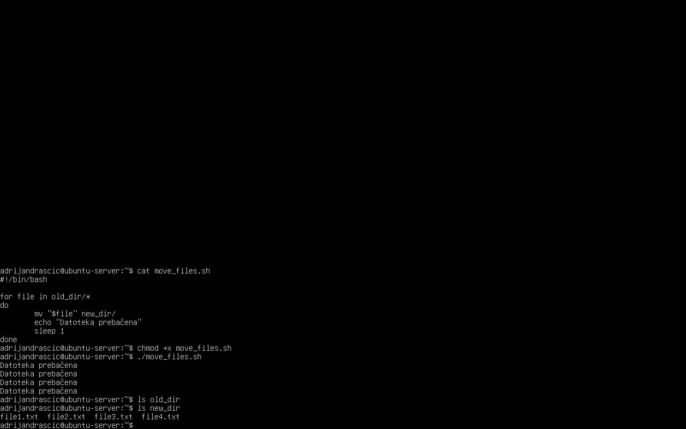

Nakon provjere ispravnosti rada skripte, potrebno ju je pokrenuti sa zadanim, većim i manjim NI prioritetom te prikazati rezultat u alatu `htop`.

Prije svakog pokretanja datoteke sam vratio iz direktorija `new_dir` u direktorij `old_dir`.

```bash
mv new_dir/* old_dir/
```

### Pokretanje sa zadanim NI prioritetom

Skriptu sam pokrenuo bez dodatnih parametara.

```bash
./move_files.sh &
```

U alatu `htop` vidljivo je da proces koristi zadani prioritet:

- PRI = 20
- NI = 0

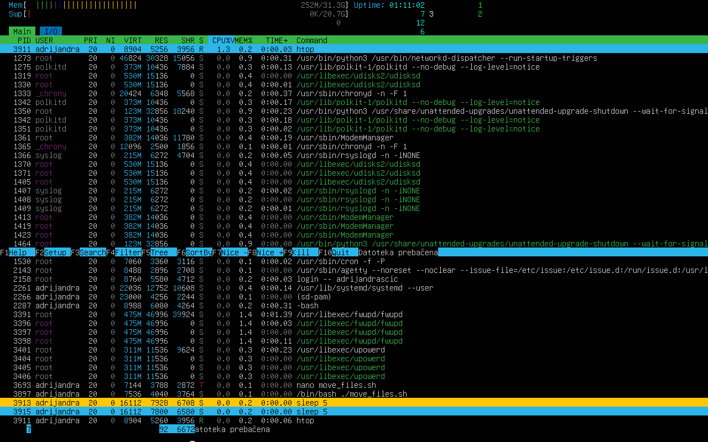

### Pokretanje s većim NI prioritetom

Skriptu sam pokrenuo naredbom:

```bash
nice -n 10 ./move_files.sh &
```

U alatu `htop` vidljivo je:

- PRI = 30
- NI = 10

Veća NI vrijednost znači manji prioritet procesa u raspoređivanju procesorskog vremena.

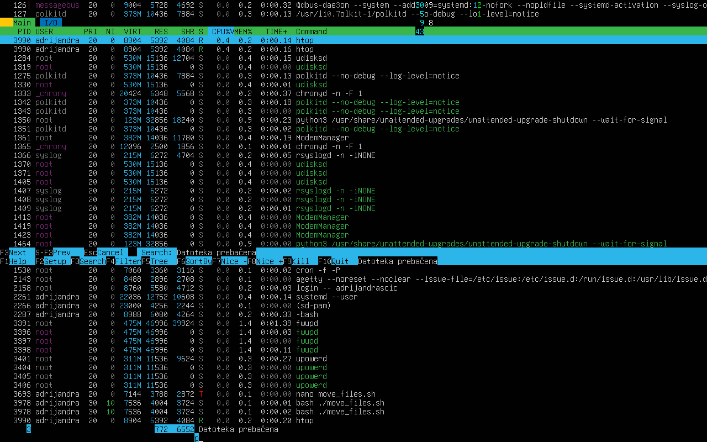

### Pokretanje s manjim NI prioritetom

Skriptu sam pokrenuo naredbom:

```bash
sudo nice -n -10 ./move_files.sh
```

U alatu `htop` vidljivo je:

- PRI = 10
- NI = -10

Manja NI vrijednost daje procesu veći prioritet pri izvršavanju.

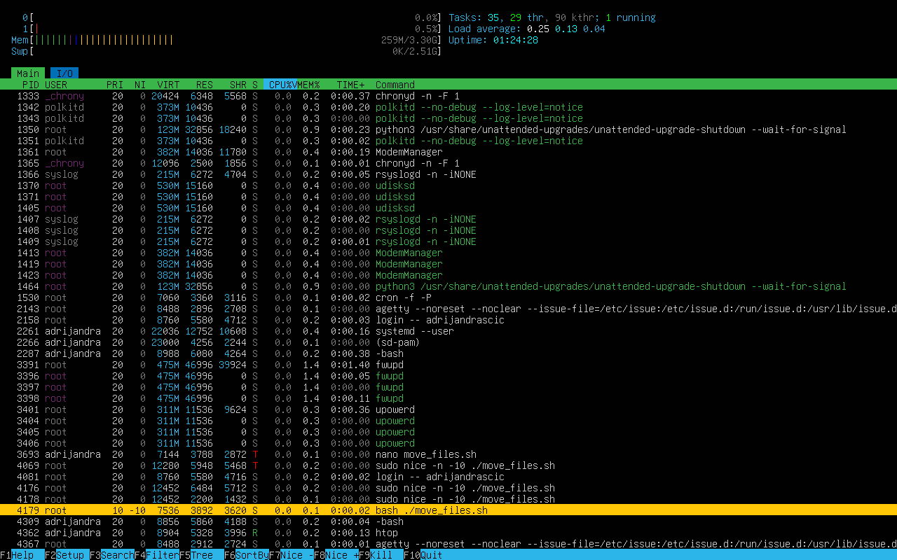

Time je uspješno demonstrirano pokretanje skripte sa zadanim, većim i manjim NI prioritetom te promatranje njihovih vrijednosti u alatu `htop`.

## Zadatak 3

Potrebno je definirati novu grupu `devteam`, kreirati direktorij `project`, dodati korisnike u grupu te postaviti odgovarajuće vlasništvo i dozvole.

Najprije sam kreirao novu grupu `devteam`.

```bash
sudo groupadd devteam
```

Postojanje grupe provjerio sam naredbom:

```bash
getent group devteam
```


Nakon toga pozicionirao sam se u vlastiti home direktorij i kreirao direktorij `project`.

```bash
cd ~

mkdir project
```

Provjeru direktorija izvršio sam naredbom:

```bash
ls -ls project
```


Zatim sam kreirao tri nova korisnika.

```bash
sudo useradd -m developer1
sudo useradd -m developer2
sudo useradd -m developer3
```

Korisnike sam dodao u grupu `devteam`.

```bash
sudo usermod -aG devteam developer1
sudo usermod -aG devteam developer2
sudo usermod -aG devteam developer3
```

Članstvo korisnika u grupi provjerio sam naredbama:

```bash
groups developer1
groups developer2
groups developer3
```

Rezultat pokazuje da su svi korisnici uspješno dodani u grupu `devteam`.

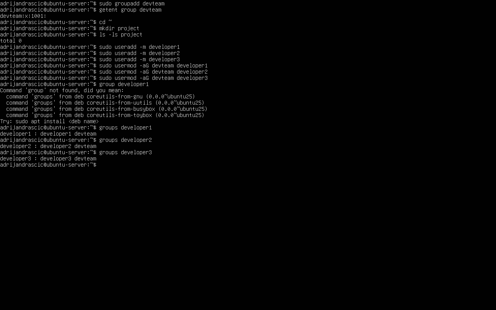

Nakon toga promijenio sam grupu direktorija `project` na `devteam`.

```bash
sudo chgrp devteam project
```

Promjenu sam provjerio naredbom:

```bash
ls -ld project
```

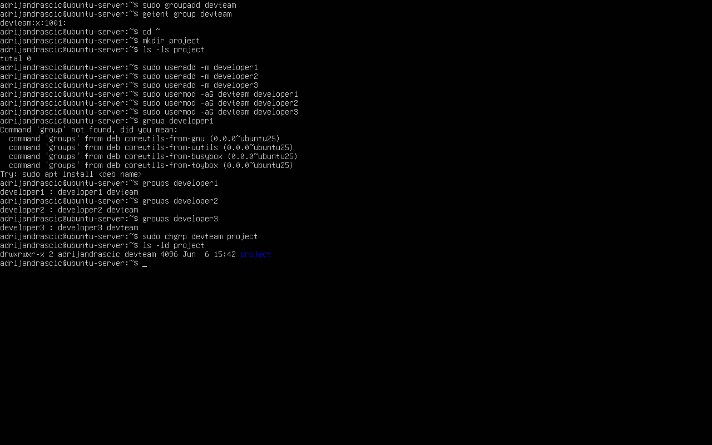

Na kraju sam postavio dozvole direktorija tako da:

- vlasnik može čitati, pisati i ulaziti u direktorij,
- članovi grupe `devteam` mogu čitati, pisati i ulaziti u direktorij,
- ostali korisnici mogu čitati sadržaj i ulaziti u direktorij.

Za to sam koristio dozvolu `775`.

```bash
chmod 775 project
```

Provjeru dozvola izvršio sam naredbom:

```bash
ls -ld project
```

Rezultat prikazuje dozvole:

```text
drwxrwxr-x
```

što odgovara zahtjevima zadatka.

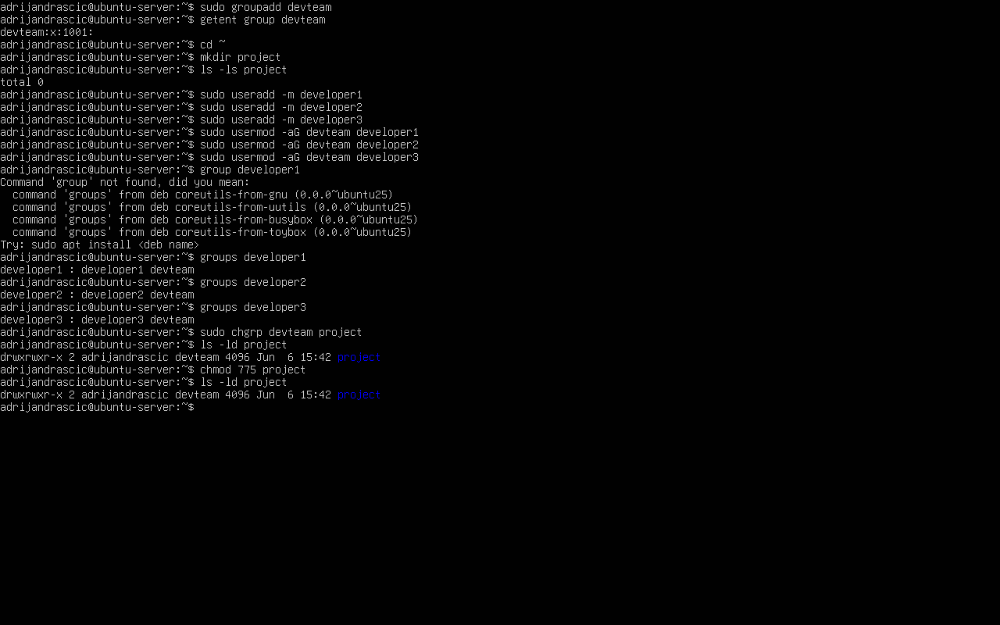

## Zadatak 4

U ovom zadatku potrebno je odrediti oktalne reprezentacije zadanih znakovnih dozvola te opisati što pojedina dozvola omogućuje vlasniku, grupi i ostalim korisnicima.

| Znakovna dozvola | Oktalna reprezentacija |
| ---------------- | ---------------------- |
| `rwxr-xr-x`      | `755`                  |
| `rw-r--r--`      | `644`                  |
| `rwx------`      | `700`                  |
| `rw-rw-r--`      | `664`                  |
| `rwxrwxrwx`      | `777`                  |
| `r--r--r--`      | `444`                  |
| `rw-------`      | `600`                  |

### Objašnjenje dozvola

* `rwxr-xr-x` (`755`) - vlasnik može čitati, pisati i izvršavati, grupa može čitati i izvršavati, a ostali korisnici mogu čitati i izvršavati.

* `rw-r--r--` (`644`) - vlasnik može čitati i pisati, grupa može samo čitati, a ostali korisnici mogu samo čitati.

* `rwx------` (`700`) - vlasnik može čitati, pisati i izvršavati, dok grupa i ostali korisnici nemaju nikakve dozvole.

* `rw-rw-r--` (`664`) - vlasnik i grupa mogu čitati i pisati, a ostali korisnici mogu samo čitati.

* `rwxrwxrwx` (`777`) - vlasnik, grupa i ostali korisnici mogu čitati, pisati i izvršavati.

* `r--r--r--` (`444`) - vlasnik, grupa i ostali korisnici mogu samo čitati.

* `rw-------` (`600`) - vlasnik može čitati i pisati, dok grupa i ostali korisnici nemaju nikakve dozvole.

## Zadatak 5

U ovom zadatku bilo je potrebno napisati Bash skriptu koja prima dva argumenta:

1. znakovnu reprezentaciju dozvola, npr. `rwxr-xr--`
2. apsolutnu putanju do datoteke

Skripta zatim treba izračunati oktalnu reprezentaciju dozvole i primijeniti ju na zadanu datoteku.

Izradio sam skriptu `apply.sh`.

```bash
nano apply.sh
```

Sadržaj skripte:

```bash
#!/bin/bash

if [ "$#" -ne 2 ]; then
    echo "Greška: potrebno je unijeti točno 2 argumenta."
    exit 1
fi

perm="$1"
file="$2"

if [ ${#perm} -ne 9 ]; then
    echo "Greška: dozvola mora imati točno 9 znakova."
    exit 1
fi

owner=0
group=0
other=0

[ "${perm:0:1}" = "r" ] && owner=$((owner+4))
[ "${perm:1:1}" = "w" ] && owner=$((owner+2))
[ "${perm:2:1}" = "x" ] && owner=$((owner+1))

[ "${perm:3:1}" = "r" ] && group=$((group+4))
[ "${perm:4:1}" = "w" ] && group=$((group+2))
[ "${perm:5:1}" = "x" ] && group=$((group+1))

[ "${perm:6:1}" = "r" ] && other=$((other+4))
[ "${perm:7:1}" = "w" ] && other=$((other+2))
[ "${perm:8:1}" = "x" ] && other=$((other+1))

chmod "$owner$group$other" "$file"

echo "Postavljena dozvola: $owner$group$other"
```

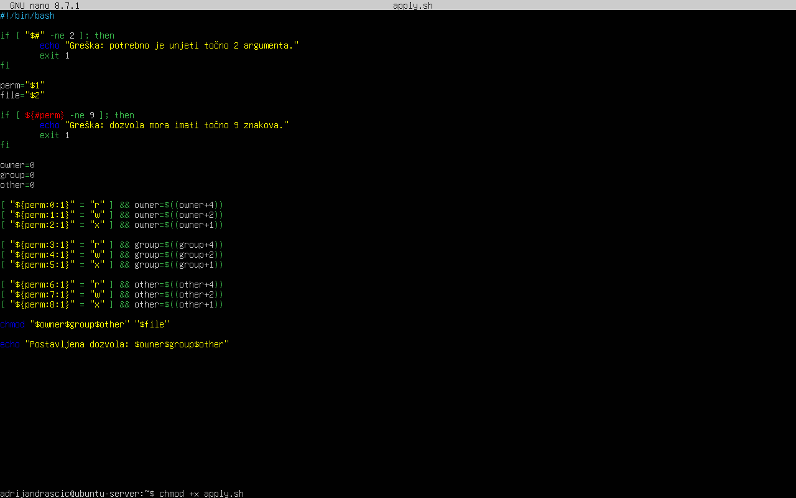

Nakon izrade skripte dodijelio sam joj dozvolu za izvršavanje.

```bash
chmod +x apply.sh
```

Za testiranje sam kreirao datoteku `test.txt`.

```bash
touch test.txt
```

Skriptu sam pokrenuo s dozvolom `rwxr-xr--` i apsolutnom putanjom do datoteke.

```bash
./apply.sh rwxr-xr-- /home/adrijandrascic/test.txt
```

Skripta je izračunala oktalnu vrijednost `754` i primijenila ju na datoteku.

```text
Postavljena dozvola: 754
```

Provjeru sam napravio naredbom:

```bash
ls -l test.txt
```

Rezultat prikazuje dozvolu:

```text
-rwxr-xr--
```

što potvrđuje da je skripta ispravno pretvorila znakovnu reprezentaciju u oktalnu i primijenila ju pomoću naredbe `chmod`.

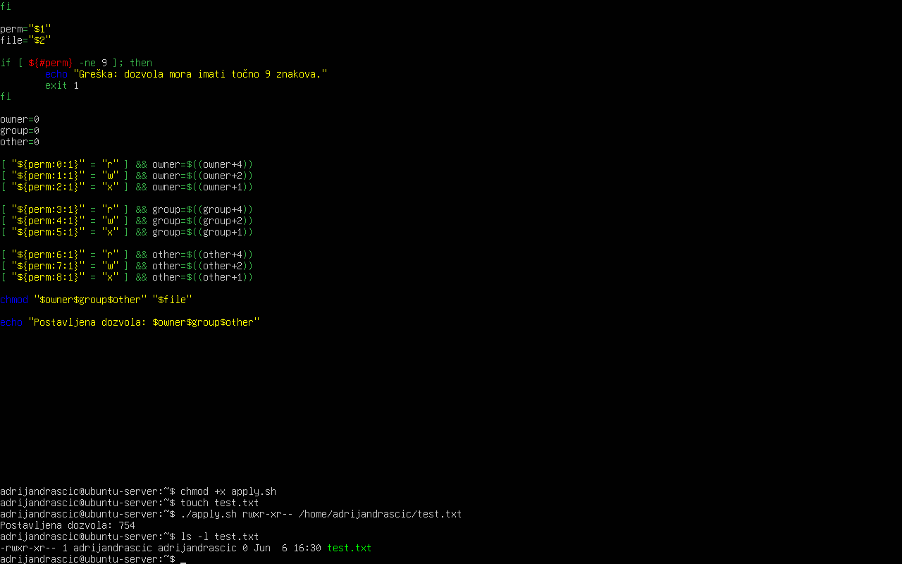
